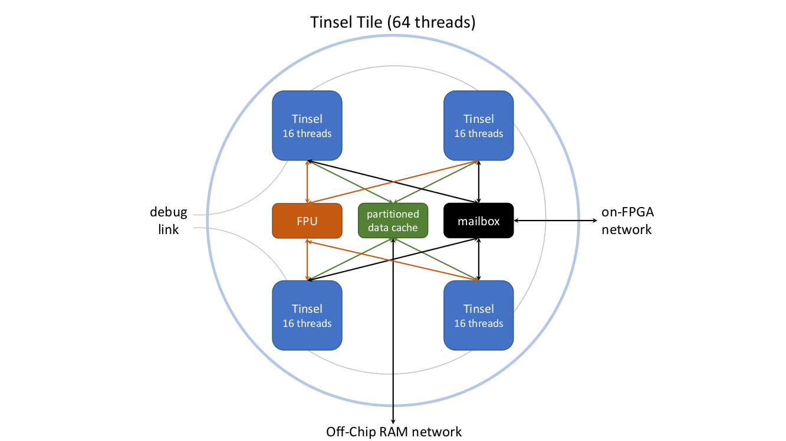
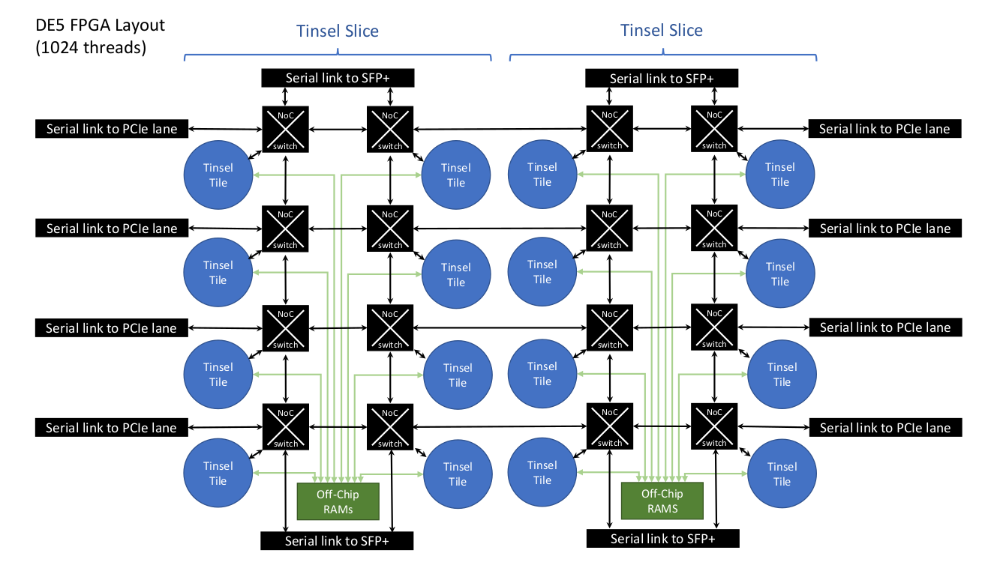
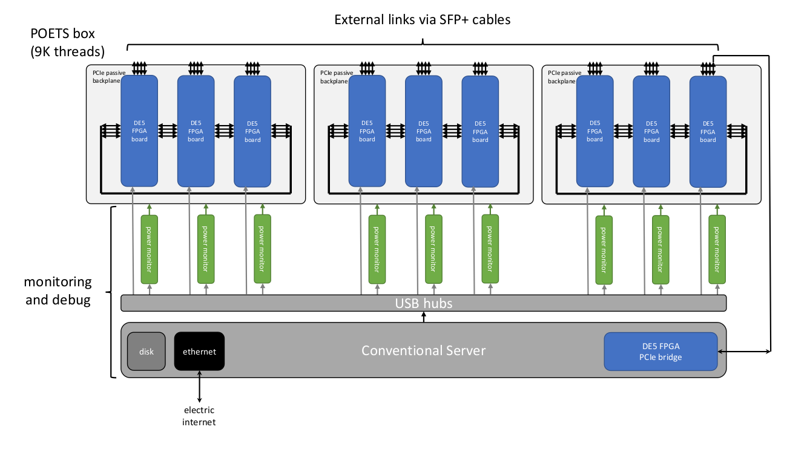

# Tinsel 0.5

Tinsel is a [RISC-V](https://riscv.org/)-based manythread
message-passing architecture designed for FPGA clusters.  It is being
developed as part of the [POETS
Project](https://poets-project.org/about) (Partially Ordered Event
Triggered Systems).  This manual describes the Tinsel architecture and
associated APIs.  If you're a POETS Partner, you can access a
machine running Tinsel in the
[POETS Cloud](https://github.com/POETSII/poets-cloud).

## Release Log

* [v0.2](https://github.com/POETSII/tinsel/releases/tag/v0.2):
Released on 12 Apr 2017 and maintained in the
[tinsel-0.2 branch](https://github.com/POETSII/tinsel/tree/tinsel-0.2).
(First single-board release.)
* [v0.3](https://github.com/POETSII/tinsel/releases/tag/v0.3):
Released on 11 Jun 2018 and maintained in the
[tinsel-0.3.1 branch](https://github.com/POETSII/tinsel/tree/tinsel-0.3.1).
(Multi-board plus PCIe host-link.)
* [v0.4](https://github.com/POETSII/tinsel/releases/tag/v0.4):
Released on 10 Sep 2018 and maintained in the
[tinsel-0.4.1 branch](https://github.com/POETSII/tinsel/tree/tinsel-0.4.1).
(2D NoC plus off-chip SRAMs.)
* v0.5: Under development in the master branch.

## Contents

* [1. Overview](#1-tinsel-overview)
* [2. Tinsel Core](#2-tinsel-core)
* [3. Tinsel Cache](#3-tinsel-cache)
* [4. Tinsel Mailbox](#4-tinsel-mailbox)
* [5. Tinsel Network](#5-tinsel-network)
* [6. Tinsel HostLink](#6-tinsel-hostlink)

## Appendices

* [A. DE5-Net Synthesis Report](#a-de5-net-synthesis-report)
* [B. Tinsel Parameters](#b-tinsel-parameters)
* [C. Tinsel Memory Map](#c-tinsel-memory-map)
* [D. Tinsel CSRs](#d-tinsel-csrs)
* [E. Tinsel Address Structure](#e-tinsel-address-structure)
* [F. Tinsel API](#f-tinsel-api)
* [G. HostLink API](#g-hostlink-api)
* [H. Limitations on RV32IMF](#h-limitations-on-rv32imf)

## 1. Overview

Efficient communication and low power consumption are two key goals in
the construction of scalable computer systems. Potentially, both can
be achieved using commodity FPGA development boards. These boards
combine state-of-the-art networking facilities with reconfigurable
logic which, when customised to a particular application or
application domain, can offer better performance-per-watt than other
commodity devices such as CPUs and GPUs.

Despite their potential, FPGA-based systems face challenges. Low-level
hardware description languages and long synthesis times are major
barriers to productivity for application developers. An attractive
approach for the [POETS Project](https://poets-project.org/about) is
therefore to provide a soft-core overlay architecture on top of the
FPGA logic that can be programmed quickly and easily using standard
software languages and tools. While this overlay is not customised to
a particular POETS *application*, it is at least customised to the
POETS *application domain*. This is a natural first step because
higher levels of customisation are more ambitious and would, in any
case, reuse components and ideas from the overlay.

In the remainder of this section we give an overview of our soft-core
overlay architecture for POETS, called *Tinsel*.

### 1.1 Compute Subsystem

Simulation of the physical world, and large-scale graph analytics, are
two of the main target application domains for POETS technology, and
this leads to two important requirements on the POETS hardware:
floating-point support (for physics calculations) and off-chip
memories (for storing large graphs). On FPGA, both floating-point
operations and off-chip memory accesses are known to introduce
significant latency into the system. A critical aspect of the design
is therefore to tolerate this latency as cleanly as possible.

In response, we have developed a custom multithreaded processor called
Tinsel -- a 32-bit RISC-V floating-point-enabled processor supporting
up to 32 threads per core. Multithreading allows the processor to stay
busy even when some threads are blocked on the result of a latent
operation.  Multithreading also tolerates the latency of arbitration
logic, allowing efficient sharing of large components such as FPUs and
caches between cores.

At most one instruction per thread is allowed in the core's pipeline
at any time, eliminating all control and data hazards.  This leads to
a small, simple, high-frequency design that is able to execute one
instruction per cycle provided there are sufficient parallel threads,
which we expect to be the case for POETS.  Custom instructions are
provided for sending and receiving messages between threads running on
the same core or different cores.  

### 1.2 Memory Subsystem

Although there is a requirement to support a large amount of memory,
it is not necessary to provide the illusion of a single shared memory
space: message-passing is intended to be the primary communication
mechanism.

To keep the programming model simple, we have opted to use data caches
to optimise access to off-chip memory rather than DMA.  The Tinsel
cache can serve requests at full-throughput (one per cycle) and a
typical RISC workload will access data memory once every four
instructions, so a cache can usefully be shared by up to four cores.
Provided that threads typically access all the words of cache line
before it is evicted, a single DDR3 DRAM can satisfy around 32 cores.

### 1.3 Communication Subsystem

Tinsel provides custom instructions for sending and receiving messages
(up to 512 bits in size) between any two threads in the system.  One
of the challenges in supporting such large messages is the amount of
serialisation/deserialisation required to get a message into/out-of a
32-bit core.  Our solution is to use a dual-ported memory-mapped
mailbox with a 32-bit port connected to the core and a much wider port
connected to the on-chip network.  The mailbox stores both incoming
and outgoing messages.  A message can be forwarded (received and sent)
with just two instructions, which is useful to implement efficient
multicasting in software.  A single mailbox can be shared between
several cores, reducing the size of the on-chip network needed connect
the mailboxes together.
 
Fundamental to POETS is the ability to scale the hardware to an
arbitrary number of cores, and hence we must exploit multiple FPGAs.
The inter-board serial communication links available on modern FPGAs
are both numerous and fast but, like all serial links, some errors are
to be expected.  Therefore, on top of a raw link we place a 10Gbps
Ethernet MAC, which automatically detects and drops packets containing
CRC errors.  On top of the MAC we place our own window-based
reliability layer that retransmits dropped packets.  The use of
Ethernet allows us to use mostly standard (and free) IP cores for
inter-board communication.  And since we are using the links
point-to-point, almost all of the Ethernet packet fields can be used
for our own purposes, resulting in very little overhead on the wire.

### 1.4 POETS Hardware

A prototype POETS hardware system is currently under construction and,
when complete, will consist of around 50 DE5-Net FPGA boards connected
by numerous high-speed serial links in a 3D mesh topology.  Each group
of 7-10 FPGAs will reside in a separate *POETs box*.  One FPGA in each
box will serve as a *PCI Express bridge board* that connects a modern
PC to the remaining FPGA *worker boards*, with the worker boards
running Tinsel by default.

### 1.5 Structure

The following diagrams are *illustrative* of a Tinsel system running
on a POETS box.  The system is highly-parameterised, so the actual
numbers of component parts shown may vary.

#### Tinsel Tile

A Tinsel tile consists of four Tinsel cores sharing a mailbox, an FPU,
and a data cache.
 


#### Tinsel Slice

Each FPGA contains two *Tinsel Slices*, with each slice comprising
eight tiles connected to one 4GB DDR3 DIMM and two 8MB QDRII+ SRAMs.
All tiles are connected together via a 2D NoC.  At the edges of the
NoC are the inter-FPGA links, with the north and south edges using
SFP+ connectors, and the east and west edges using PCIe lanes.  Note
that the number of inter-FPGAs links at each edge is illustrative.



#### POETS box

A POETS box comprises of a modern PC, a PCIe FPGA bridge board
connecting the PC to the worker FPGAs, and three FPGA-triplets.  Each
FPGA triplet consists of three worker FPGAs connected in a ring via a
PCIe backplane.  Each FPGA has a further four inter-FPGA links via
SFP+ cables.  A power monitor between the PC and each FPGA allows
inidividual software-controlled power-switching of the FPGAs from the
PC.  Each FPGA is also connected to the PC via a 4MB/s USB serial
link.



(Above we see three PCIe backplanes per box, giving a 3x3 arragement
of worker FPGAs. Due to thermal issues, we are currently using only
two FPGAs per backplane, giving a 3x2 arrangement, and we are moving
towards a design with two PCIe backplanes per box, which will
eventually give a 2x3 arrangement.)

## 2. Tinsel Core

Tinsel Core is a *customised* 32-bit *multi-threaded* processor
implementing a [subset](#h-missing-rv32imf-features) of the RV32IMF
profile of the [RISC-V](https://riscv.org/specifications/) ISA.
Custom features are provided through a range of control/status
registers ([CSRs](#d-tinsel-csrs)).

The number of hardware threads must be a power of two and is
controlled by a sythesis-time parameter `LogThreadsPerCore`.  For
example, with `LogThreadsPerCore=4`, each core implements 2^4 (16)
threads.

Tinsel employs a generous *8-stage pipeline* to achieve a high Fmax.
The pipeline is *hazard-free*: at most one instruction per thread is
present in the pipeline at any time.  To achieve *full throughput*
-- execution of an instruction on every clock cycle -- there must
exist at least 8 *runnable* threads at any time.  When a thread
executes a multi-cycle instruction (such as an off-chip load/store, a
blocking send/receive, or a floating-point operation), it becomes
*suspended* and is only made runnable again when the instruction
completes.  While suspended, a thread is not present in the queue of
runnable threads from which the scheduler will select the next thread,
so does not burn CPU cycles.

The core fetches instructions from an *instruction memory* implemented
using on-chip block RAM.  The size of this memory is controlled by the
synthesis-time parameter `LogInstrsPerCore`.  All threads in a core
share the same instruction memory.  If the `SharedInstrMem` parameter
is `True` then each instruction memory will be shared by up to two
cores, using the dual-port feature of block RAMs. Otherwise, if it is
`False` then each core will have its own instruction memory.  The
initial contents of the memory is specified in the FPGA bitstream and
typically contains a boot loader.  The instruction memory is not
memory-mapped (i.e. not accessible via load/store instructions) but
two CSRs are provided for writing instructions into the memory:
`InstrAddr` and `Instr`.

  CSR Name    | CSR    | R/W | Function
  ----------- | ------ | --- | --------
  `InstrAddr` | 0x800  | W   | Set address for instruction write
  `Instr`     | 0x801  | W   | Write to instruction memory

There is a read-only CSR for determining the globally unique id of the
currently running thread (the structure of this id is defined in
the [Tinsel Network](#5-tinsel-network) section).

  CSR Name    | CSR    | R/W | Function
  ----------- | ------ | --- | --------
  `HartId`    | 0xf14  | R   | Globally unique hardware thread id

On power-up, only a single thread (with id 0) is present in the run
queue of each core.  Further threads can be added to the run queue by
writing to the `NewThread` CSR (as typically done by the boot loader).
Threads can also be removed from the run-queue using the `KillThread`
CSR.

  CSR Name     | CSR    | R/W | Function
  ------------ | ------ | --- | --------
  `NewThread`  | 0x80d  | W   | Insert thread with given id into run-queue
  `KillThread` | 0x80e  | W   | Don't reinsert current thread into run-queue

Access to all of these CSRs is wrapped up by the following C functions
in the [Tinsel API](#f-tinsel-api).

```c
// Write 32-bit word to instruction memory
inline void tinselWriteInstr(uint32_t addr, uint32_t word);

// Return a globally unique id for the calling thread
inline uint32_t tinselId();

// Insert new thread into run queue
// (The new thread has a program counter of 0)
inline void tinselCreateThread(uint32_t id);

// Don't reinsert currently running thread back in to run queue
inline void tinselKillThread();
```

Single-precision floating-point operations are implemented by the
*Tinsel FPU*, which may be shared by any number of cores, as defined
by the `LogCoresPerFPU` parameter.  Note that, because the FPU is
implemented using IP blocks provided by the FPGA vendor, there are
some [limitations](h-missing-rv32imf-features) with respect to the
RISC-V spec.  Most FPU operations have a high latency on the
[DE5-Net](http://de5-net.terasic.com) (up to 14 clock cycles) so
multithreading is important for efficient implementation.

A summary of synthesis-time parameters introduced in this section:

  Parameter           | Default | Description
  ------------------- | ------- | -----------
  `LogThreadsPerCore` |       4 | Number of hardware threads per core
  `LogInstrsPerCore`  |      11 | Size of each instruction memory
  `SharedInstrMem`    |    True | Is each instruction memory shared by 2 cores?
  `LogCoresPerFPU`    |       2 | Number of cores sharing a floating-point unit

## 3. Tinsel Cache

The [DE5-Net](http://de5-net.terasic.com) contains two off-chip DDR3
DRAMs, each capable of performing two 64-bit memory operations on
every cycle of an 800MHz clock (one operation on the rising edge and
one on the falling edge).  By serial-to-parallel conversion, a single
256-bit memory operation can be performed by a single DIMM on every
cycle of a 400MHz core clock.  This means that when a core performs a
32-bit load, it potentially throws away 224 of the bits returned by
DRAM.  To avoid this, we use a *data cache* local to a group of cores,
giving the illusion of a 32-bit memory while behind-the-scenes
transferring 256-bit *lines* (or larger, see below) between the cache
and DRAM.

The [DE5-Net](http://de5-net.terasic.com) also contains four off-chip
QDRII+ SRAMs, each with a capacity of 8MB and capable of performing a
64-bit read and a 64-bit write on every cycle of a 225MHz clock.  One
DRAM and two SRAMS are mapped into the cached address space of each
thread (see [Tinsel Memory Map](#c-tinsel-memory-map)).

The cache line size must be larger than or equal to the DRAM data bus
width: lines are read and written by the cache in contiguous chunks
called *beats*.  The width of a beat is defined by
`DCacheLogWordsPerBeat` and the width of a line by
`DCacheLogBeatsPerLine`.  At present, the width of the DRAM data bus
must equal the width of a cache beat.

The number of cores sharing a cache is controlled by the
synthesis-time parameter `LogCoresPerDCache`.  A sensible value for
this parameter is two (giving four cores per cache), based on the
observation that a typical RISC workload will issue a memory
instruction once in every four instructions.

The number of caches sharing a DRAM is controlled by
`LogDCachesPerDRAM`.  A sensible value for this parameter on the
[DE5-Net](http://de5-net.terasic.com) with a 400MHz core clock might
be three, which combined with a `LogCoresPerDCache` of two, gives 32
cores per DRAM: assuming one cache miss in every eight accesses (ratio
between 32-bit word and 256-bit DRAM bus) and one memory instruction
in every four cycles per core, the full bandwidth will be saturated by
32 cores (1/8 \* 1/4 = 1/32).

For applications with lower memory-bandwidth requirements, the value
of `LogCoresPerDCache` might be increased to three, giving 64 cores
per DRAM.  (As a point of comparison,
[SpiNNaker](http://apt.cs.manchester.ac.uk/projects/SpiNNaker/) shares
a 1.6GB/s DRAM amongst 16 x 200MHz cores, giving 4 bits per
core-cycle.  For the same data width per core-cycle, each 12.8GB/s
DIMM on the [DE5-Net](http://de5-net.terasic.com) could serve 64 x
400MHz cores.)

The cache is an *N*-way *set-associative write-back* cache with a
*pseudo least-recently-used*
([Pseudo-LRU](https://en.wikipedia.org/wiki/Pseudo-LRU)) replacement
policy.  It is designed to serve one or more highly-threaded cores,
where high throughput and high Fmax are more important than low
latency.  It employs a hash function that appends the thread id and
some number of address bits.  This means that cache lines are *not
shared* between threads and, consequently, there is no aliasing
between threads.

The cache pipeline is *hazard-free*: at most one request per thread
is present in the pipeline at any time which, combined with the
no-sharing property above, implies that in-flight requests always
operate on different lines, simplifying the implementation.  To allow
cores to meet this assumption, store responses are issued in addition
to load responses.

A *cache flush* function is provided that evicts all cache lines
owned by the calling thread.

```c
// Full cache flush
// (Issues flush request for every line, and waits until all requests are done)
inline void tinselCacheFlush();

// Flush given cache line
// (Issues flush request, but doesn't wait until request is done)
inline void tinselFlushLine(uint32_t lineNum, uint32_t way)
```

These functions are implemented using the following CSR.

  CSR Name     | CSR    | R/W | Function
  ------------ | ------ | --- | --------
  `Flush`      | 0xc01  | W   | Cache line flush (line number, way)

The following parameters control the number of caches and the
structure of each cache.

  Parameter                | Default | Description
  ------------------------ | ------- | -----------
  `LogCoresPerDCache`      |       2 | Cores per cache
  `LogDCachesPerDRAM`      |       3 | Caches per DRAM
  `DCacheLogWordsPerBeat`  |       3 | Number of 32-bit words per beat
  `DCacheLogBeatsPerLine`  |       0 | Beats per cache line
  `DCacheLogNumWays`       |       2 | Cache lines in each associative set
  `DCacheLogSetsPerThread` |       3 | Associative sets per thread
  `LogBeatsPerDRAM`        |      26 | Size of DRAM

## 4. Tinsel Mailbox

The *mailbox* is a component used by threads to send and receive
messages.  A single mailbox serves multiple threads, defined by
`LogCoresPerMailbox`.  Mailboxes are connected together to form a
network on which any thread can send a message to any other thread
(see section [Tinsel Mailbox Network](#5-tinsel-mailbox-network)), but
communication is more efficient between threads that share the same
mailbox.

A Tinsel *message* is comprised of a bounded number of *flits*.  A
thread can send a message containing any number of flits (up to the
bound defined by `LogMaxFlitsPerMsg`), but conceptually the message is
treated as an *atomic unit*: at any moment, either the whole message
has reached the destination or none of it has.  As one would expect,
shorter messages consume less bandwidth than longer ones.  The size of
a flit is defined by `LogWordsPerFlit`.

At the heart of a mailbox is a memory-mapped *scratchpad* that
stores both incoming and outgoing messages.  Each thread has access to
space for several messages in the scratchpad, defined by
`LogMsgsPerThread`.  As well as storing messages, the scratchpad may
also be used as a small thread-local general-purpose memory.

Once a thread has written a message to the scratchpad, it can trigger
a *send* operation, provided that the `CanSend` CSR returns true.  It
does so by: (1) writing the number of flits in the message to the
`SendLen` CSR; (2) writing the address of the message in the
scratchpad to the `SendPtr` CSR; and (3) writing the destination
thread id to the `Send` CSR.

  CSR Name   | CSR    | R/W | Function
  ---------- | ------ | --- | --------
  `CanSend`  | 0x803  | R   | 1 if can send, 0 otherwise
  `SendLen`  | 0x806  | W   | Set message length for send
  `SendPtr`  | 0x807  | W   | Set message pointer for send
  `Send`     | 0x808  | W   | Send message to supplied destination

The [Tinsel API](#f-tinsel-api) provides wrapper functions for accessing
these CSRs.

```c
// Determine if calling thread can send a message
inline uint32_t tinselCanSend();

// Set message length for send operation
// (A message of length n is comprised of n+1 flits)
inline void tinselSetLen(uint32_t n);

// Send message at address to destination
// (Address must be aligned on message boundary)
inline void tinselSend(uint32_t dest, volatile void* addr);

// Get pointer to nth message-aligned slot in mailbox scratchpad
inline volatile void* tinselSlot(uint32_t n);
```

Several things to note:

* After sending a message, a thread must not modify the
contents of that message while `tinselCanSend()` returns false,
otherwise the in-flight message could be corrupted.

* The `SendLen` and `SendPtr` CSRs are persistent: if two consecutive
send operations wish to use the same length and address then the CSRs
need only be written once.

* The scratchpad pointer must be aligned on a max-message-size
boundary, which we refer to as a message *slot*. The `tinselSlot`
function yields a pointer to the nth slot in the calling thread's mailbox.

To *receive* a message, a thread must first *allocate* a slot in the
scratchpad for an incoming message to be stored.  Allocating a slot
can be viewed as transferring ownership of that slot from the software
to the hardware.  This is done by writing the address of the slot to
the `Alloc` CSR.  Multiple slots can be allocated, bounded by
`LogMsgsPerThread`, creating a receive buffer of the desired capacity.

The hardware may use any one of the allocated slots to store an
incoming message, but as soon as a slot is used it will be
automatically *deallocated*.  Now, provided the `CanRecv` CSR returns
true, the `Recv` CSR can be read, yielding a pointer to the slot
containing a received message.  Receiving a message can be viewed as
transferring ownership of a slot from the hardware to the software.
As soon as the thread is finished with the message, it can
*reallocate* it, restoring capacity to the receive buffer.  On
power-up, no slots are allocated for receiving messages, i.e. all
slots are owned by software and none by hardware.

 CSR Name   | CSR    | R/W | Function
 ---------- | ------ | --- | --------
 `Alloc`    | 0x802  | W   | Allocate slot in scratchpad for receiving a message
 `CanRecv`  | 0x805  | R   | 1 if can receive, 0 otherwise
 `Recv`     | 0x809  | R   | Return pointer to a received message

Again, the [Tinsel API](#f-tinsel-api) hides these low-level CSRs.

```c
// Give mailbox permission to use given slot to store an incoming message
inline void tinselAlloc(volatile void* addr);

// Determine if calling thread can receive a message
inline uint32_t tinselCanRecv();

// Receive message
inline volatile void* tinselRecv();
```

When more than one slot contains an incoming message, `tinselRecv()`
will select the one with the lowest address.  This means that the
order in which messages are received by software is not neccesarily
equal to the order in which they arrived at the mailbox.  Given the
*partially-ordered* nature of POETS, we feel that this is a reasonable
property.

Sometimes, a thread may wish to wait until it can send or receive.  To
avoid busy waiting on the `tinselCanSend()` and `tinselCanRecv()`
functions, a thread can be suspended by writing to the `WaitUntil`
CSR.

  CSR Name    | CSR    | R/W | Function
  ----------- | ------ | --- | --------
  `WaitUntil` | 0x80a  | W   | Sleep until can send or receive

This CSR is treated as a bit string: bit 0 indicates whether the
thread would like to be woken when a send is possible, and bit 1
indicates whether the thread would like to be woken when a receive is
possible.  Both bits may be set, in which case the thread will be
woken when a send *or* a receive is possible. The [Tinsel
API](#f-tinsel-api) abstracts this CSR as follows.

```c
// Thread can be woken by a logical-OR of these events
typedef enum {TINSEL_CAN_SEND = 1, TINSEL_CAN_RECV = 2} TinselWakeupCond;

// Suspend thread until wakeup condition satisfied
inline void tinselWaitUntil(TinselWakeupCond cond);
```

One of the main goals of the mailbox is to support efficient software
multicasting: when a message is received, it can be forwarded on to
multiple destinations without having to serialise the message contents
into and out of the 32-bit core.  The mailbox scratchpad has a
flit-sized port on the network side, providing much more efficient
access to messages than is possible from the core.

Tinsel also provides a function 

```c++
  int tinselIdle(bool vote);
```

which blocks until either

  1. a message is available to receive, or

  2. all threads in the entire system are blocked on a call to
     `tinselIdle()` and there are no undelivered messages in the system.

The function returns zero in the former case and non-zero in the
latter.  A return value of 1 denotes a non-unanamous vote, i.e. not
all callers voted true, and a return value > 1 denotes a unanamous
vote, i.e. all callers voted true.  This feature allows efficient
termination detection in asynchronous applications and efficient
barrier synchronisation in synchronous applications.  The voting
mechanism additionally allows termination to be detected in
synchronous applications, e.g. all threads in the system are stable
since the last time step.  For more details, see the original feature
proposal: [PIP 13](doc/PIP-0013-idle-detection.md).

A summary of synthesis-time parameters introduced in this section:

  Parameter                | Default | Description
  ------------------------ | ------- | -----------
  `LogCoresPerMailbox`     |       2 | Number of cores sharing a mailbox
  `LogWordsPerFlit`        |       2 | Number of 32-bit words in a flit
  `LogMaxFlitsPerMsg`      |       2 | Max number of flits in a message
  `LogMsgsPerThread`       |       4 | Number of slots per thread in scratchpad

## 5. Tinsel Network

The number of mailboxes on each FPGA board is goverened by the
parameter `LogMailboxesPerBoard`.

  Parameter                | Default | Description
  ------------------------ | ------- | -----------
  `LogMailboxesPerBoard`   |       4 | Number of mailboxes per FPGA board

The mailboxes are connected together by a 2D network-on-chip (NoC)
carrying message flits (see section [Tinsel
Mailbox](#4-tinsel-mailbox)).  The network ensures that flits from
different messages are not interleaved or, equivalently, flits from
the same message appear *contiguously* between any two mailboxes.
This avoids complex logic for reassembling messages.  It also avoids
the deadlock case whereby a receiver's buffer is exhausted with
partial messages, yet is unable to provide a single whole message for
the receiver to consume in order free space.

It is more efficient to send messages between threads that share a
mailbox than between threads on different mailboxes.  This is because,
in the former case, flits are simply copied from one part of a
scratchpad to another using a wide, flit-sized, read/write port.  Such
messages do not occupy any bandwidth on the bidirectional bus
connecting the mailboxes.

It is also more efficient to send messages between threads on
neighbouring mailboxes, w.r.t. the 2D NoC, than between threads on
distant mailboxes.  This is because, in the former case, the message
spends less time on the network, consuming less bandwidth.

The mailbox network extends across multiple FPGA boards arranged in a
*2D mesh* of size `MeshXLen` x `MeshYLen`.

  Parameter      | Default | Description
  -------------- | ------- | -----------
  `MeshXBits`    |       2 | Number of bits in mesh X coordinate
  `MeshYBits`    |       2 | Number of bits in mesh Y coordinate
  `MeshXLen`     |       3 | Length of X dimension
  `MeshYLen`     |       3 | Length of Y dimension

A *globally unique thread id*, as returned by `tinselId()`, has the
following structure from MSB to LSB.

  Field                 | Width  
  --------------------- | ------------
  Board Y coord         | `MeshYBits`
  Board X coord         | `MeshXBits`
  Board-local core id   | `LogCoresPerBoard`
  Core-local thread id  | `LogThreadsPerCore`

Each board-to-board communication port is implemented on top of a
*10Gbps ethernet MAC*, which automatically detects and drops packets
containing CRC errors.  On top of the MAC sits our own window-based
reliability layer that retransmits dropped packets.  We refer to this
combination of components as a *reliable link*. The use of ethernet
allows us to use mostly standard (and free) IP cores for inter-board
communication.  And since we are using the links point-to-point,
almost all of the ethernet header fields can be used for our own
purposes, resulting in very little overhead on the wire.

## 6. Tinsel HostLink

*HostLink* is the means by which Tinsel cores running on a mesh of
FPGA boards communicate with a *host PC*.  It comprises three main
communication channels:

* An FPGA *bridge board* that connects to the host PC via PCI
Express and to the FPGA mesh via a 10Gbps reliable link.  Using this
high-bandwidth channel (around 1GB/s), the host PC can efficiently
send messages to any Tinsel thread and vice-versa.

* A set of *debug links* connecting the host PC to each FPGA via
separate USB UART cables.  These low-bandwidth connections (around
4MB/s each) are virtualised to provide every hardware thread with
`stdin` and `stdout` byte streams.  They are intended for
debugging and can be used to implement functions such as `printf` and
`getchar`.

* A set of *power links* connecting the host PC to each FPGA's
*power management module* via separate USB UART cables.  These
connections can be used to power-on/power-off each FPGA and to monitor
power consumption and temperature.

A Tinsel application typically consists of two programs: one which runs on the
RISC-V cores, linked against the [Tinsel API](#f-tinsel-api), and the other
which runs on the host PC, linked against the [HostLink API](#g-hostlink-api).
The HostLink API is implemented as a C++ class called `HostLink`.  The
constructor for this class first carries out a reset of the hardware: (1) all
of the mesh FPGAs are powered down; (2) a soft-reset of the bridge board is
performed; and (3) all of the mesh FPGAs are powered up.  On power-up the FPGAs
are automatically programmed using the Tinsel bit-file residing in flash
memory, and are ready to be used within a few seconds, as soon as the
`HostLink` constructor returns.

Methods for sending and receiving messages on the host PC are as
follows.

```cpp
// Send a message (blocking)
void HostLink::send(uint32_t destAddr, uint32_t numFlits, void* msg);

// Can send a message without blocking?
bool HostLink::canSend();

// Receive a flit (blocking)
void HostLink::recv(void* flit);

// Can receive a flit without blocking?
bool HostLink::canRecv();

// Receive a message (blocking), given size of message in bytes
// Any bytes beyond numBytes up to the next flit boundary will be ignored
void HostLink::recvMsg(void* msg, uint32_t numBytes);
```

Although the `send` method allows a message consisting of multiple
flits to be sent, the `recv` method only returns a single flit at a
time and does not indicate the number of flits present in the message
currently being received.  The length of a message, if not statically
known, must therefore be encoded in the message contents.  Flits
belonging to the same message will be received contiguously, in order.
If the length of the message is known statically, `recvMsg` can be
used and any bytes beyond `numBytes` up to the next flit boundary will
be ignored.  This is useful when a `struct` is being used to hold
messages, in which case the second argument to `recvMsg` is simply the
`sizeof` the `struct`.  The `recvMsg` function assumes that the size
of the struct is less than or equal to the maximum message size.

These methods for sending a receiving messages work by connecting to a
local [PCIeStream deamon](/hostlink/pciestreamd.cpp) via a UNIX domain
socket.  The daemon in turn communicates with the FPGA bridge board
via PCI Express, initiating DMA transactions for efficient data
transfer, and requires that the
[dmabuffer](/hostlink/driver/dmabuffer.c) kernel module is loaded.
For low-level details, see the comments at
the top of [PCIeStream.bsv](/rtl/PCIeStream.bsv) and
[DE5BridgeTop.bsv](/rtl/DE5BridgeTop.bsv).

The following helper functions are provided for constructing and
deconstructing addresses (globally unique thread ids).

```cpp
// Address construction
uint32_t HostLink::toAddr(uint32_t meshX, uint32_t meshY,
                          uint32_t coreId, uint32_t threadId);

// Address deconstruction
void HostLink::fromAddr(uint32_t addr, uint32_t* meshX, uint32_t* meshY,
                                       uint32_t* coreId, uint32_t* threadId);
```

To send a message from a Tinsel thread to the host PC, the thread
needs to know the address of the host PC.  A suitable address depends
on how the bridge board is connected to the FPGA mesh, and we provide
the following Tinsel API function to abstract over this detail.

```c
// Get globally unique thread id of the host PC
inline uint32_t tinselHostId()
```

The following `HostLink` member variables are used to access the
individual debug links to each FPGA and the bridge board.

```cpp
// Debug link to the bridge board (initialised by HostLink constructor)
DebugLink* bridgeBoard;

// Debug links to the mesh boards (initialised by HostLink constructor)
DebugLink* mesh[TinselMeshXLen][TinselMeshYLen];
```

The `DebugLink` class provides several methods on these links.  One
such method allows querying of a board to determine its unique
identifier, i.e.  its X and Y coordinates in the mesh.

```cpp
// Put query request
void DebugLink::putQuery();

// Get query response, including board id
bool DebugLink::getQuery(uint32_t* boardId);
```

The board id returned by ``getQuery`` is either 0, denoting the bridge
board, or 1+*b* denoting a mesh board with identifier *b*.  To send
bytes to a thread's input stream, one first needs to set the
destination address.

```cpp
// Set destination core and thread
void DebugLink::setDest(uint32_t coreId, uint32_t threadId);

// Set destinations to given thread id on every core
void DebugLink::setBroadcastDest(uint32_t threadId);
```

After that, bytes can be sent and received using the functions:

```cpp
// Send byte to destination thread (StdIn)
void DebugLink::put(uint8_t byte);

// Receive byte (StdOut)
void DebugLink::get(uint32_t* coreId, uint32_t* threadId, uint8_t* byte);

// Is a data available for reading?
bool DebugLink::canGet();
```

For low-level details about the DebugLink protocol, see the comments
at the top of [DebugLink.bsv](/rtl/DebugLink.bsv).

On the FPGA side, the following CSRs can be used to send and receive
bytes over the debug link.

  Name        | CSR    | R/W | Function
  ----------- | ------ | --- | --------
  `FromUart`  | 0x80b  | R   | Try to read byte from StdIn
  `ToUart`    | 0x80c  | RW  | Try to write byte to StdOut

Bits `[7:0]` of `FromUart` contain the byte received and bit 8
indicates whether or not a byte was received.  The `ToUart` CSR should
be read and written atomically using the `cssrw` instruction and the
value read is non-zero on success (the write may fail due to
back-pressure).  These CSRs are used to implement the following
non-blocking functions in the Tinsel API:

```c
// Receive byte from StdIn (over DebugLink)
// (Byte returned in bits [7:0]; bit 8 indicates validity)
inline uint32_t tinselUartTryGet();

// Send byte to StdOut (over DebugLink)
// (Returns non-zero on success)
inline uint32_t tinselUartTryPut(uint8_t x);
```

On power-up, only a single Tinsel thread (with id 0) on each core is
active and running a [boot loader](/apps/boot/boot.c).  When the boot
loader is running, the HostLink API supports the following methods.

```cpp
// Load application code and data onto the mesh
void HostLink::boot(const char* codeFilename, const char* dataFilename);

// Trigger to start application execution
void HostLink::go();

// Set address for remote memory access to given board via given core
// (This address is auto-incremented on loads and stores)
void HostLink::setAddr(uint32_t meshX, uint32_t meshY,
                       uint32_t coreId, uint32_t addr);

// Store words to remote memory on given board via given core
void HostLink::store(uint32_t meshX, uint32_t meshY,
                     uint32_t coreId, uint32_t numWords, uint32_t* data);
```

The format of the code and data files is *verilog hex format*, which
is easily produced using standard RISC-V compiler tools.

Once the `go()` method is invoked, the boot loader activates all
threads on all cores and calls the application's `main()` function.
When the application is running (and hence the boot loader is not
running) HostLink methods that communicate with the boot loader should
not be called.  When the application returns from `main()`, all but
one thread on each core are killed and the remaining threads reenter
the boot loader.

## A. DE5-Net Synthesis Report

The default Tinsel configuration on a single DE5-Net board contains:

  * 64 cores
  * 16 threads per core
  * (1024 threads in total)
  * 16 mailboxes
  * 16 caches
  * 16 floating-point units
  * 2D network-on-chip
  * two DDR3 DRAM controllers
  * four QDRII+ SRAM controllers
  * four 10Gbps reliable links
  * one termination/idle detector
  * a JTAG UART

The clock frequency is 250MHz and the resource utilisation is 135K
ALMs, *58% of the DE5-Net*.

## B. Tinsel Parameters

  Parameter                | Default | Description
  ------------------------ | ------- | -----------
  `LogThreadsPerCore`      |       4 | Number of hardware threads per core
  `LogInstrsPerCore`       |      11 | Size of each instruction memory
  `SharedInstrMem`         |    True | Is each instr memory shared by 2 cores?
  `LogCoresPerFPU`         |       2 | Number of cores sharing an FPU
  `LogCoresPerDCache`      |       2 | Cores per cache
  `LogDCachesPerDRAM`      |       3 | Caches per DRAM
  `DCacheLogWordsPerBeat`  |       3 | Number of 32-bit words per beat
  `DCacheLogBeatsPerLine`  |       0 | Beats per cache line
  `DCacheLogNumWays`       |       2 | Cache lines in each associative set
  `DCacheLogSetsPerThread` |       3 | Associative sets per thread
  `LogBeatsPerDRAM`        |      26 | Size of DRAM
  `SRAMAddrWidth`          |      20 | Address width of each off-chip SRAM
  `LogBytesPerSRAMBeat`    |       3 | Data width of each off-chip SRAM
  `LogCoresPerMailbox`     |       2 | Number of cores sharing a mailbox
  `LogWordsPerFlit`        |       2 | Number of 32-bit words in a flit
  `LogMaxFlitsPerMsg`      |       2 | Max number of flits in a message
  `LogMsgsPerThread`       |       4 | Number of slots per thread in scratchpad
  `LogMailboxesPerBoard`   |       4 | Number of mailboxes per FPGA board
  `MeshXBits`              |       2 | Number of bits in mesh X coordinate
  `MeshYBits`              |       2 | Number of bits in mesh Y coordinate
  `MeshXLen`               |       3 | Length of X dimension
  `MeshYLen`               |       3 | Length of Y dimension
  `EnablePerfCount`        |    True | Enable performance counters

## C. Tinsel Memory Map

  Region                  | Description
  ----------------------- | -----------
  `0x00000000-0x000003ff` | Reserved
  `0x00000400-0x000007ff` | Thread-local mailbox scratchpad
  `0x00000800-0x000fffff` | Reserved
  `0x00800000-0x00ffffff` | Cached off-chip SRAM A
  `0x01000000-0x017fffff` | Cached off-chip SRAM B
  `0x01800000-0x7fffffff` | Cached off-chip DRAM
  `0xc0000000-0xffffffff` | Partition-interleaved cached off-chip DRAM

Note that the regions `0x40000000-0x7fffffff` and
`0xc0000000-0xffffffff` map *to the same memory* in DRAM.  The only
difference is that `0xc0000000-0xffffffff` is *partition interleaved*.
The idea is that this region can hold a private partition for each
thread, e.g. its stack and heap.  When all threads access their
partitions at the same time, it can be beneficial for DRAM performance
to interleave the partitions at the cache-line granularity -- and
that's what the `0xc0000000-0xffffffff` region provides.  This
partition-interleaved region is, by default, used for each thread's
private stack and heap.

Applications should *either* use region `0x40000000-0x7fffffff` *or*
region `0xc0000000-0xffffffff`, but not both.  This is because the
address translation to implement interleaving is applied after the
caches in the memory hierarchy, so the cache considers them as
separate memory regions (which they are not).

## D. Tinsel CSRs

  Name         | CSR    | R/W | Function
  ------------ | ------ | --- | --------
  `InstrAddr`  | 0x800  | W   | Set address for instruction write
  `Instr`      | 0x801  | W   | Write to instruction memory
  `Alloc`      | 0x802  | W   | Alloc space for new message in scratchpad
  `CanSend`    | 0x803  | R   | 1 if can send, 0 otherwise
  `HartId`     | 0xf14  | R   | Globally unique hardware thread id
  `CanRecv`    | 0x805  | R   | 1 if can receive, 0 otherwise
  `SendLen`    | 0x806  | W   | Set message length for send
  `SendPtr`    | 0x807  | W   | Set message pointer for send
  `Send`       | 0x808  | W   | Send message to supplied destination
  `Recv`       | 0x809  | R   | Return pointer to message received
  `WaitUntil`  | 0x80a  | W   | Sleep until can-send or can-recv
  `FromUart`   | 0x80b  | R   | Try to read byte from StdIn
  `ToUart`     | 0x80c  | RW  | Try to write byte to StdOut
  `NewThread`  | 0x80d  | W   | Insert thread with given id into run-queue
  `KillThread` | 0x80e  | W   | Don't reinsert current thread into run-queue
  `Emit`       | 0x80f  | W   | Emit char to console (simulation only)
  `FFlag`      | 0x001  | RW  | Floating-point accrued exception flags
  `FRM`        | 0x002  | R   | Floating-point dynamic rounding mode
  `FCSR`       | 0x003  | RW  | Concatenation of FRM and FFlag
  `Cycle`      | 0xc00  | R   | 32-bit cycle counter
  `Flush`      | 0xc01  | W   | Cache line flush (line number, way)

Optional performance-counter CSRs (when `EnablePerfCount` is `True`):

  Name             | CSR    | R/W | Function
  ---------------- | ------ | --- | --------
  `PerfCount`      | 0xc07  | W   | Reset(0)/Start(1)/Stop(2) all counters
  `MissCount`      | 0xc08  | R   | Cache miss count
  `HitCount`       | 0xc09  | R   | Cache hit count
  `WritebackCount` | 0xc0a  | R   | Cache writeback count
  `CPUIdleCount`   | 0xc0b  | R   | CPU idle-cycle count

## E. Tinsel Address Structure

A globally unique thread id has the following structure from MSB to
LSB.

  Field                 | Width  
  --------------------- | ------------
  Board Y coord         | `MeshYBits`
  Board X coord         | `MeshXBits`
  Board-local core id   | `LogCoresPerBoard`
  Core-local thread id  | `LogThreadsPerCore`

## F. Tinsel API

```c
// Return a globally unique id for the calling thread
inline uint32_t tinselId();

// Read cycle counter
inline uint32_t tinselCycleCount();

// Write 32-bit word to instruction memory
inline void tinselWriteInstr(uint32_t addr, uint32_t word);

// Cache flush
inline void tinselCacheFlush();

// Get pointer to nth message-aligned slot in mailbox scratchpad
inline volatile void* tinselSlot(uint32_t n);

// Determine if calling thread can send a message
inline uint32_t tinselCanSend();

// Set message length for send operation
// (A message of length n is comprised of n+1 flits)
inline void tinselSetLen(uint32_t n);

// Send message at address to destination
// (Address must be aligned on message boundary)
inline void tinselSend(uint32_t dest, volatile void* addr);

// Give mailbox permission to use given slot to store an incoming message
inline void tinselAlloc(volatile void* addr);

// Determine if calling thread can receive a message
inline uint32_t tinselCanRecv();

// Receive message
inline volatile void* tinselRecv();

// Thread can be woken by a logical-OR of these events
typedef enum {TINSEL_CAN_SEND = 1, TINSEL_CAN_RECV = 2} TinselWakeupCond;

// Suspend thread until wakeup condition satisfied
inline void tinselWaitUntil(TinselWakeupCond cond);

// Send byte to host (over DebugLink UART)
// (Returns non-zero on success)
inline uint32_t tinselUartTryPut(uint8_t x);

// Receive byte from host (over DebugLink UART)
// (Byte returned in bits [7:0]; bit 8 indicates validity)
inline uint32_t tinselUartTryGet();

// Insert new thread into run queue
// (The new thread has a program counter of 0)
inline void tinselCreateThread(uint32_t id);

// Don't reinsert currently running thread back in to run queue
inline void tinselKillThread();

// Emit word to console (simulation only)
inline void tinselEmit(uint32_t x);

// Get the globally unique thread id of the host PC
inline uint32_t tinselHostId();

// Return pointer to base of thread's DRAM partition
inline void* tinselHeapBase();

// Return pointer to base of thread's SRAM partition
inline void* tinselHeapBaseSRAM();

// Reset performance counters
inline void tinselPerfCountReset();

// Start performance counters
inline void tinselPerfCountStart();

// Stop performance counters
inline void tinselPerfCountStop();

// Performance counter: get the cache miss count
inline uint32_t tinselMissCount();

// Performance counter: get the cache hit count
inline uint32_t tinselHitCount();

// Performance counter: get the cache writeback count
inline uint32_t tinselWritebackCount();

// Performance counter: get the CPU-idle count
inline uint32_t tinselCPUIdleCount();
```

## G. HostLink API

Only the main functionality of HostLink is presented here.  For full
details see [HostLink.h](/hostlink/HostLink.h) and
[DebugLink.h](/hostlink/DebugLink.h).

```cpp
class HostLink {
 public:

  // Debug links
  // -----------

  // Link to the bridge board (opened by constructor)
  DebugLink* bridgeBoard;

  // Links to the mesh boards (opened by constructor)
  DebugLink* mesh[TinselMeshXLen][TinselMeshYLen];

  // Send and receive messages over PCIe
  // -----------------------------------

  // Send a message (blocking)
  void send(uint32_t dest, uint32_t numFlits, void* msg);

  // Can send a message without blocking?
  bool canSend();

  // Receive a flit (blocking)
  void recv(void* flit);

  // Can receive a flit without blocking?
  bool canRecv();

  // Receive a message (blocking), given size of message in bytes
  // Any bytes beyond numBytes up to the next flit boundary will be ignored
  void recvMsg(void* msg, uint32_t numBytes);

  // Address construction/deconstruction
  // -----------------------------------

  // Address construction
  uint32_t toAddr(uint32_t meshX, uint32_t meshY,
             uint32_t coreId, uint32_t threadId);

  // Address deconstruction
  void fromAddr(uint32_t addr, uint32_t* meshX, uint32_t* meshY,
         uint32_t* coreId, uint32_t* threadId);

  // Assuming the boot loader is running on the cores
  // ------------------------------------------------
  //
  // (Only thread 0 on each core is active when the boot loader is running)

  // Load application code and data onto the mesh
  void boot(const char* codeFilename, const char* dataFilename);

  // Trigger to start application execution
  void go();

  // Set address for remote memory access to given board via given core
  // (This address is auto-incremented on loads and stores)
  void setAddr(uint32_t meshX, uint32_t meshY,
               uint32_t coreId, uint32_t addr);

  // Store words to remote memory on given board via given core
  void store(uint32_t meshX, uint32_t meshY,
             uint32_t coreId, uint32_t numWords, uint32_t* data);

  // Finer-grained control over application loading and execution
  // ------------------------------------------------------------

  // Load instructions into given core's instruction memory
  void loadInstrsOntoCore(const char* codeFilename,
         uint32_t meshX, uint32_t meshY, uint32_t coreId);

  // Load data via given core on given board
  void loadDataViaCore(const char* dataFilename,
         uint32_t meshX, uint32_t meshY, uint32_t coreId);

  // Start given number of threads on given core
  void startOne(uint32_t meshX, uint32_t meshY,
         uint32_t coreId, uint32_t numThreads);

  // Trigger application execution on all started threads on given core
  void goOne(uint32_t meshX, uint32_t meshY, uint32_t coreId);
};
```

```cpp
class DebugLink {
 public:

  // Open UART with given instance id
  void open(int instId);

  // Put query request
  void putQuery();

  // Get query response, including board id
  bool getQuery(uint32_t* boardId);

  // Set destination core and thread
  void setDest(uint32_t coreId, uint32_t threadId);

  // Set destinations to core-local thread id on every core
  void setBroadcastDest(uint32_t threadId);

  // Send byte to destination thread (StdIn)
  void put(uint8_t byte);

  // Receive byte (StdOut)
  void get(uint32_t* coreId, uint32_t* threadId, uint8_t* byte);

  // Is a data available for reading?
  bool canGet();
  
  // Flush writes
  void flush();

  // Close UART
  void close();
};
```

## H. Limitations on RV32IMF

Tinsel implements the RV32IMF profile, except for the following:

  * System calls and debugging: `ecall`, `ebreak`.
  * Some CSR instructions: `csrrs`, `csrrc`, `csrrwi`, `csrrsi`, `csrrci`.
  * Integer division: `div`, `divu`, `rem`, `remu`.
  * Some floating point instructions: `fsqrt`, `fmin`, `fmax`,
    `fclassify`, `fmadd`, `fnmadd`, `fmsub`, `fnmsub`.
  * Misaligned loads and stores.

Other than integer division, none of these instructions (to our
knowledge) are generated by the compiler if the `-ffp-contract=off`
flag is passed to `gcc`.  Only the `csrrw` instruction is provided for
accessing CSRs.  There is a [script](/bin/checkelf.sh) to check a
compiled ELF for the presence of these unimplemented instructions (it
will not detect misaligned loads and stores however).

We use Altera blocks to implement floating-point instructions and
inerhit a number of limitations:

  * *Invalid* and *inexact* exception flags are not signalled.
  * One rounding mode only: *round-to-nearest with ties-to-even*.
  * Signed integer to floating-point conversion only: `fcvt.s.w` and
    `fcvt.s.wu` both convert from *signed* integers.
  * Floating-point to signed integer conversion only: 
    `fcvt.w.s` and `fcvt.w.su` both convert to *signed*
    integers.
  * The fixed rounding mode leads to an incompatibility with the C standard
    when casting from a `float` to an `int`.
    See [Issue #55](https://github.com/POETSII/tinsel/issues/55) for
    more details.
  * The conversion instructions to not respect the RISC-V spec in the
    presence of NaNs and infinities.
  * Floating-point division may not be correctly rounded.
    See [Issue #54](https://github.com/POETSII/tinsel/issues/54)
    for more details.
