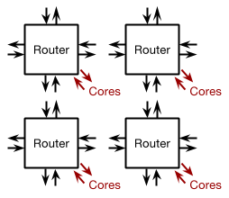

# Tinsel

**Tinsel** is a **many-core message-passing** machine designed for
massively parallel computing on an **FPGA cluster**.  It is not
specific to any particular FPGA board, but the description below
uses Terasic's [DE5-NET](http://de5-net.terasic.com) for illustration
purposes.  (This is a fairly high-end board that the
[CL](http://www.cl.cam.ac.uk/) has in plentiful supply.)

This respository is work-in-progress: many elements are incomplete and
everything is subject to change!

## Contents

Like any large system, Tinsel is comprised of several modules:

1. [Tinsel Core](#tinsel-core)
2. [Tinsel Cache](#tinsel-cache)
3. [Tinsel Router](#tinsel-router)
4. [Tinsel Board](#tinsel-board)

## Tinsel Core

**Tinsel Core** is a 32-bit **multi-threaded** processor implementing the
[RISC-V](https://riscv.org/specifications/) ISA (RV32I).

The number of hardware threads must be a power of two and is
controlled by a sythesis-time parameter `LogThreadsPerCore`.

It employs a generous **9-stage pipeline** to achieve an Fmax in
excess of 400MHz on the [DE5-NET](http://de5-net.terasic.com), while
consuming less than 450 LUTs (0.2%).

The pipeline is **hazard-free**: at most one instruction per thread
can be present in the pipeline at any time.  To achieve **full
throughput** -- execution of an instruction on every clock cycle -- the
number of hardware threads must be greater than the pipeline depth.
The first power of two that satisfies this requirement is 16.

In fact, the requirement is slightly stronger than this: for full
throughput, there must exist at least 9 **runnable** threads at any time.
When a thread executes a multi-cycle instruction (such as a DRAM
load/store or a blocking send/receive), it becomes **suspended** and is
only made runnable again when the instruction completes.  While
suspended, a thread is not present in the queue of runnable threads
from which the scheduler will select the next thread, so does
not burn CPU cycles.

A 9-stage pipeline is perhaps excessive but incurs little cost on
FPGA, and there will be no shortage of program threads in the
massively-parallel applications for which the machine is intended.

The core fetches instructions from a 2-cycle latent **instruction
memory** implemented using on-chip block RAM.  The size of this memory
is controlled by the synthesis-time parameter `LogInstrsPerCore`.  All
threads in a core share the same instruction memory.  In fact, the instruction
memory is dual-ported and may be shared by two cores.  The initial
contents of the memory is specified in the FPGA bitstream which can be
regenerated in seconds during application development.

A globally unique identifier for the currently running thread can be
obtained from a RISC-V [control/status
register](https://riscv.org/specifications/privileged-isa/) (CSR
`0xF14`).  The `Tinsel.h` header file provides a function to read this
register:

```
// Return a globally unique id for the calling hardware thread
inline uint32_t me()
{
  uint32_t id;
  asm("csrr %0, 0xF14" : "=r"(id));
  return id;
}

```

A summary of parameters introduced in this section:

  Parameter                 | Description
  ------------------------- | -----------
  `LogThreadsPerCore`       | Number of hardware threads per core
  `LogInstrsPerCore`        | Size of each instruction memory

## Tinsel Cache

The [DE5-NET](http://de5-net.terasic.com) contains two DDR3 DIMMs,
each capable of performing two 64-bit memory operations on every cycle
of an 800MHz clock (one operation on the rising edge and one on the
falling edge).  By serial-to-parallel conversion, a single 256-bit
memory operation can be performed by a single DIMM on every cycle of a
400MHz core clock.  This means that when a core performs a 32-bit
load, it potentially throws away 224 of the bits returned by DRAM.  To
avoid this, we use a **data cache** local to a group of cores, giving
the illusion of a 32-bit memory while behind-the-scenes transferring
256-bit **lines** (or larger, see below) between the cache and DRAM.

The cache line size must be larger than or equal to the DRAM data bus
width: lines are read and written by the cache in contiguous chunks
called **beats**.  The width of a beat is defined by
`DCacheLogWordsPerBeat` and the width of a line by
`DCacheLogBeatsPerLine`.  The width of the DRAM data bus must equal
the width of a cache beat.

The number of cores sharing a cache is controlled by the
synthesis-time parameter `LogCoresPerDCache`.  A sensible value for
this parameter is two (giving four cores per cache), based on the
observation that a typical RISC workload will issue a memory
instruction once in every four instructions.

The number of caches sharing a DRAM is controlled by
`LogDCachesPerDRAM`.  A sensible value for this parameter on the
[DE5-NET](http://de5-net.terasic.com) with a 400MHz core clock might
be three, which combined with a `LogCoresPerDCache` of two, gives 32
cores per DRAM: assuming one cache miss in every eight accesses (ratio
between 32-bit word and 256-bit DRAM bus) and one memory instruction
in every four cycles per core, the full bandwidth will be saturated by
32 cores (1/8 \* 1/4 = 1/32).

For applications with lower memory-bandwidth requirements, the value
of `LogCoresPerDCache` might be increased to three, giving 64 cores
per DRAM.  (As a point of comparison,
[SpiNNaker](http://apt.cs.manchester.ac.uk/projects/SpiNNaker/) shares
a 1.6GB/s DRAM amongst 16 x 200MHz cores, giving 2 bytes per
core-cycle.  For the same data width per core-cycle, each 12.8GB/s
DIMM on the [DE5-NET](http://de5-net.terasic.com) could serve 64 x
400MHz cores.)

The cache is an *N*-way **set-associative write-back** cache.
It is designed to serve one or more highly-threaded cores, where high
throughput and high Fmax are more important than low latency.  It
employs a hash function that appends the thread id and some number of
address bits.  This means that cache lines are **not shared** between
threads (and consequently, there is no aliasing between threads).

The cache pipeline is **hazard-free**: at most one request per thread
is present in the pipeline at any time which, combined with the
no-sharing property above, implies that in-flight requests always
operate on different lines, simplifying the implementation.  To allow
cores to meet this assumption, store responses are issued in addition
to load responses.

The cache implements a low-cost **coherence mechanism**.  When a
thread issues a `fence` instruction, all cache lines for that thread are
invalidated and all dirty lines are written out to DRAM.  If a thread
wishes to make its writes visible to other threads then it issues a
`fence`.  Similarly, if a thread wishes to make sure it can read the
latest values written by other threads then it also issues a `fence`.
This scheme meets the [WMO without local dependencies]
(https://github.com/CTSRD-CHERI/axe/raw/master/doc/manual.pdf)
consistency model, where a thread may observe operations by
another thread out-of-order but reorderings over a `fence` are
forbidden.

`Tinsel.h` defines a `fence()` function as follows.

```
// Memory fence: memory operations can't appear to be reordered over this
inline void fence()
{
  asm volatile("fence");
}

```

There is no support for **atomic** memory operations.  Tinsel is a
message-passing machine and it is not clear that atomics are needed.
For example, instead of gaining exclusive write access to a block of
shared memory in order to perform an atomic update, a message can be
sent to the owner of the block (by software) telling it to perform the
update.

The following parameters control the number of caches and the
structure of each cache.

  Parameter                 | Description
  ------------------------- | -----------
  `LogCoresPerDCache`       | Cores per cache
  `LogDCachesPerDRAM`       | Caches per DRAM
  `DCacheLogWordsPerBeat`   | Number of 32-bit words per beat
  `DCacheLogBeatsPerLine`   | Beats per cache line
  `DCacheLogNumWays`        | Cache lines in each associative set
  `DCacheLogSetsPerThread`  | Associative sets per thread

## Tinsel Router

A **2D mesh** of **routers** implements the intra-FPGA communication
fabric, enabling any thread to send a **packet** to any other thread
on the same FPGA.

</img>

Each router has five bi-directional links: *north*, *south*, *east*
and *west*, and a link to a group of *local* cores.  The width and
height of the 2D mesh is defined by synthesis-time parameters
`LogMeshWidth` and `LogMeshHeight`, and the number of cores local to
each router is defined by `LogCoresPerRouter`.

Packets have a **fixed-size** defined by `NumWordsPerPacket`.  The
first word in a packet contains the address of the destination thread,
and has the following bit-level representation.

```
   LogMeshWidth    LogMeshHeight   LogCoresPerRouter LogThreadsPerCore
 <--------------> <--------------> <---------------> <--------------->
+----------------+----------------+-----------------+-----------------+
| Router X coord | Router Y coord | Core id         | Thread id       |
+----------------+----------------+-----------------+-----------------+
MSB                                                                 LSB
```

The remainder of the packet is referred to as the **payload** or the
**message**.

The flow of a packet from source to destination is as follows:

  1. The sending thread enqueues a packet, one word at a time, into its
     **tx buffer**, provided there is space available.

  2. At some point, the packet is moved from the thread's tx buffer
     into the **outbox** of that thread's router.

  3. The router takes a packet from one of its input links, or its
     outbox, and emits it

       * on the west/east link  if the X coordinate
         of the destination is less/larger than the X coordinate
         of the router;

       * otherwise, on the north/south link if the Y
         coordinate of the destination is less/larger than
         the Y coordinate of the router.

  4. When the packet reaches the router with X and Y
     coordinates equal to its destination, the packet is placed in the
     router's **inbox**, provided there is space available.

  5. At some point, the packet is moved from the router's inbox into
     the **rx buffer** of the destination thread, provided
     there is space available.

This routing method is known as **dimension-ordered** routing (the X
direction is resolved first, then the Y direction).

The rx and tx buffers are accessed by each thread using the following RISC-V
[control/status
registers](https://riscv.org/specifications/privileged-isa/) (CSRs).

  CSR name    | CSR id  | Access      | Function
  ----------- | ------- | ----------- | --------
  `TxReady`   | `0x800` | read-only   | Return 1 if can send, 0 otherwise
  `RxReady`   | `0x801` | read-only   | Return 1 if can receive, 0 otherwise
  `TxSleep`   | `0x802` | read-only   | Suspend thread until it can send
  `RxSleep`   | `0x803` | read-only   | Suspend thread until it can receive
  `TxWrite`   | `0x804` | write-only  | Put word into send buffer
  `RxRead`    | `0x805` | read-only   | Consume word from recieve buffer
  `TxRxSleep` | `0x806` | read-only   | Suspend until can send or receive; return 1 if can send, 0 otherwise

The following programming API is implemented on top of the CSR interface.

```c
// Number of 32-bit words in a packet's payload
const uint32_t MSG_SIZE;

// A packet's payload
typedef struct { uint32_t word[MSG_SIZE]; } msg_t;

// Ask whether a send or receive is possible
uint32_t can_send();
uint32_t can_recv();

// Sleep until a send or receive is possible
void sleep_until_can_send();
void sleep_until_can_recv();
uint32_t sleep_until_can_send_or_recv();

// Non-blocking send and receive
void send(uint32_t dest, msg_t* msg);
void recv(msg_t* msg);
```

To summarise, the synthesis-time parameters introduced in this section
are:

  Parameter             | Description
  --------------------- | -----------
  `LogCoresPerRouter`   | Cores per router
  `LogMeshHeight`       | Height of 2D mesh of routers within an FPGA
  `LogMeshWidth`        | Width of 2D mesh of routers within an FPGA
  `NumWordsPerPacket`   | Number of 32-bit words in a packet

## Tinsel Board

Details of the inter-FPGA links and the host interface are currently
under development.
