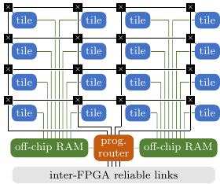

# Tinsel 0.8.3

Tinsel is a [RISC-V](https://riscv.org/)-based manythread
message-passing architecture designed for FPGA clusters.  It is being
developed as part of the [POETS
Project](https://poets-project.org/about) (Partial Ordered Event
Triggered Systems).  Further background can be found in our FPL 2019
[paper](doc/fpl-2019-paper.pdf); and our ASAP 2020
[paper](doc/asap-2020-paper.pdf) and
[video](https://sms.cam.ac.uk/media/3258486).  If you're a POETS
Partner, you can access a machine running Tinsel in the [POETS
Cloud](https://github.com/POETSII/poets-cloud).  

## Release Log

* [v0.2](https://github.com/POETSII/tinsel/releases/tag/v0.2):
Released on 12 Apr 2017 and maintained in the
[tinsel-0.2 branch](https://github.com/POETSII/tinsel/tree/tinsel-0.2).
(First single-board release.)
* [v0.3](https://github.com/POETSII/tinsel/releases/tag/v0.3):
Released on 11 Jun 2018 and maintained in the
[tinsel-0.3.1 branch](https://github.com/POETSII/tinsel/tree/tinsel-0.3.1).
(Multi-board plus PCIe host-link.)
* [v0.4](https://github.com/POETSII/tinsel/releases/tag/v0.4):
Released on 10 Sep 2018 and maintained in the
[tinsel-0.4.1 branch](https://github.com/POETSII/tinsel/tree/tinsel-0.4.1).
(2D NoC plus off-chip SRAMs.)
* [v0.5](https://github.com/POETSII/tinsel/releases/tag/v0.5):
Released on 8 Jan 2019 and maintained in the
[tinsel-0.5.1 branch](https://github.com/POETSII/tinsel/tree/tinsel-0.5.1).
(Hardware termination-detection.)
* [v0.6](https://github.com/POETSII/tinsel/releases/tag/v0.6):
Released on 11 Apr 2019 and maintained in the
[tinsel-0.6.3 branch](https://github.com/POETSII/tinsel/tree/tinsel-0.6.3).
(Multi-box cluster.)
* [v0.7](https://github.com/POETSII/tinsel/releases/tag/v0.7):
Released on 2 Dec 2019 and maintained in the
[tinsel-0.7.1 branch](https://github.com/POETSII/tinsel/tree/tinsel-0.7.1).
(Local hardware multicast.)
* [v0.8](https://github.com/POETSII/tinsel/releases/tag/v0.8):
Released on 1 Jul 2020 and maintained in the
[master branch](https://github.com/POETSII/tinsel/).
(Distributed hardware multicast.)

## Contents

* [1. Overview](#1-tinsel-overview)
* [2. High-Level Structure](#2-high-level-structure)
* [3. Tinsel Core](#3-tinsel-core)
* [4. Tinsel Cache](#4-tinsel-cache)
* [5. Tinsel Mailbox](#5-tinsel-mailbox)
* [6. Tinsel Network](#6-tinsel-network)
* [7. Tinsel Router](#7-tinsel-router)
* [8. Tinsel HostLink](#8-tinsel-hostlink)
* [9. POLite API](#9-polite-api)

## Appendices

* [A. DE5-Net Synthesis Report](#a-de5-net-synthesis-report)
* [B. Tinsel Parameters](#b-tinsel-parameters)
* [C. Tinsel Memory Map](#c-tinsel-memory-map)
* [D. Tinsel CSRs](#d-tinsel-csrs)
* [E. Tinsel Address Structure](#e-tinsel-address-structure)
* [F. Tinsel API](#f-tinsel-api)
* [G. HostLink API](#g-hostlink-api)
* [H. Limitations on RV32IMF](#h-limitations-on-rv32imf)

## 1. Overview

On the [POETS Project](https://poets-project.org/about), we are
looking at ways to accelerate applications that are naturally
expressed as a large number of small processes communicating by
message-passing.  Our first attempt is based around a manythread
RISC-V architecture called Tinsel, running on an FPGA cluster.  The
main features are:

  * **Multithreading**.  A critical aspect of the design
    is to tolerate latency as cleanly as possible.  This includes the
    latencies arising from floating-point on Stratix V FPGAs
    (tens of cycles), off-chip memories, deep pipelines
    (keeping Fmax high), and sharing of resources between cores
    (such as caches, mailboxes, and FPUs).

  * **Message-passing**. Although there is a requirement to support a
    large amount of memory, it is not necessary to provide the
    illusion of a single shared memory space: message-passing is intended
    to be the primary communication mechanism.  Tinsel provides custom
    instructions for sending and receiving messages 
    between any two threads in the cluster.

  * **Hardware termination-detection**.  A global termination event is
    triggered when every thread indicates termination and no messages
    are in-flight.  Termination can be interpreted as termination of a
    time step, or termination of the application, supporting
    both synchronous and asynchronous event-driven systems.

  * **Local hardware multicast**.  Threads can send a message to
    multiple collocated destination threads simultaneously, greatly reducing
    the number of inter-thread messages in applications exhibiting good
    locality of communication.

  * **Distributed hardware multicast**.  Programmable routers
    automatically propagate messages to any number of destination
    threads distributed throughout the cluster, minimising inter-FPGA
    bandwidth usage for distributed fanouts.

  * **Host communication**. Tinsel threads communicate with x86
    machines distributed throughout the FPGA cluster, for command and
    control, via PCI Express and USB.

  * **Custom accelerators**. Groups of Tinsel cores called tiles can
    include custom accelerators written in SystemVerilog.

This repository also includes a prototype high-level vertex-centric
programming API for Tinsel, called [POLite](#9-polite-api).

## 2. High-Level Structure

A prototype POETS hardware architecture has been constructed,
consisting of 56 DE5-Net FPGA boards connected in a 2D mesh topology
(with the possibility of moving to 3D in future).  Each group of 7
FPGAs resides in a separate *POETS box*, and there are 8 boxes in
total.  One FPGA in each box serves as a *PCI Express bridge board*
connecting a modern PC to the remaining six FPGA *worker boards*.

The following diagrams are illustrative of a Tinsel system running
on the POETS cluster.  The system is highly-parameterised, so the
actual numbers of component parts shown will vary.

#### Tinsel Tile

A Tinsel tile typically consists of four Tinsel cores sharing a
mailbox, an FPU, and a data cache.
 


There is also experimental support for [custom
accelerators](doc/custom) in tiles.

#### Tinsel FPGA

Each FPGA contains two *Tinsel Slices*, with each slice by default
comprising eight tiles connected to one 4GB DDR3 DIMM and two 8MB
QDRII+ SRAMs.  All tiles are connected together via a routers to form
a 2D NoC.  The NoC is connected to the inter-FPGA links using a
*per-board programmable router*.  Note that the per-board router also
has connections to off-chip memory: this is where the programmable
routing tables are stored.



#### FPGA Triplet

An FPGA triplet consists of three worker FPGAs connected in a ring via
a PCIe backplane.  Each FPGA has a further four pluggable inter-FPGA
links via SFP+ cables.  A power module attached to each FPGA allows
inidividual software-controlled power-switching of the FPGAs from the
host PC.  Each FPGA is also connected to the host PC via a 4MB/s USB
serial link.


#### Power module

As our cluster resides in a server room, there are a number of
remote-management requirements, e.g. *fan monitoring*, *power
measurement*, and *power switching*.  In particular, the ability to
remotely power-switch FPGAs allows fast reprogramming of the overlay
from flash, and hence a fast hard-reset capability.  To meet these
requirements, we have developed a per-FPGA *power module*:


It comprises an ARM-microcontroller-based Cypress PSoC 5, extended
with a custom power and fan management shield.  We have also extended
the PSoC with a custom FE1.1s-based USB hub, so that the two USB
connections to the ARM (debug and UART), and the one to the FPGA
(JTAG), are all exposed by a single port on the power module, reducing
cabling and improving air flow.

#### POETS box

A POETS box comprises a modern PC with a disk, a NIC, a PCIe FPGA
bridge board connecting the PC to the worker FPGAs via SFP+, and two
FPGA-triplets.


#### POETS cluster

A multi-box POETS cluster is collection of POETS boxes, with FPGAs
from different boxes connected via SFP+.  For example, here is a
of photo of our first two-box cluster.


The complete 8-box DE5-Net POETS cluster has the following 2D
structure (it doesn't yet exploit the PCIe backplanes which permit a
3D structure).


There are also plans to develop a modern version of the cluster using
Stratix 10 devices.

## 3. Tinsel Core

Tinsel Core is a *customised* 32-bit *multi-threaded* processor
implementing a [subset](#h-missing-rv32imf-features) of the RV32IMF
profile of the [RISC-V](https://riscv.org/specifications/) ISA.
Custom features are provided through a range of control/status
registers ([CSRs](#d-tinsel-csrs)).

The number of hardware threads must be a power of two and is
controlled by a sythesis-time parameter `LogThreadsPerCore`.  For
example, with `LogThreadsPerCore=4`, each core implements 2^4 (16)
threads.

Tinsel employs a generous *8-stage pipeline* to achieve a high Fmax.
The pipeline is *hazard-free*: at most one instruction per thread is
present in the pipeline at any time.  To achieve *full throughput*
-- execution of an instruction on every clock cycle -- there must
exist at least 8 *runnable* threads at any time.  When a thread
executes a multi-cycle instruction (such as an off-chip load/store, a
blocking send/receive, or a floating-point operation), it becomes
*suspended* and is only made runnable again when the instruction
completes.  While suspended, a thread is not present in the queue of
runnable threads from which the scheduler will select the next thread,
so does not burn CPU cycles.

The core fetches instructions from an *instruction memory* implemented
using on-chip block RAM.  The size of this memory is controlled by the
synthesis-time parameter `LogInstrsPerCore`.  All threads in a core
share the same instruction memory.  If the `SharedInstrMem` parameter
is `True` then each instruction memory will be shared by two cores,
using the dual-port feature of block RAMs (specifically, cores with
ids 0 and 1 in a tile share the RAM, as do cores with ids 2 and 3, and
so on).  Otherwise, if it is `False` then each core will have its own
instruction memory.  The initial contents of the memory is specified
in the FPGA bitstream and typically contains a boot loader.  The
instruction memory is not memory-mapped (i.e. not accessible via
load/store instructions) but two CSRs are provided for writing
instructions into the memory: `InstrAddr` and `Instr`.

  CSR Name    | CSR    | R/W | Function
  ----------- | ------ | --- | --------
  `InstrAddr` | 0x800  | W   | Set address for instruction write
  `Instr`     | 0x801  | W   | Write to instruction memory

There is a read-only CSR for determining the globally unique id of the
currently running thread (the structure of this id is defined in
the [Tinsel Network](#5-tinsel-network) section).

  CSR Name    | CSR    | R/W | Function
  ----------- | ------ | --- | --------
  `HartId`    | 0xf14  | R   | Globally unique hardware thread id

On power-up, only a single thread (with id 0) is present in the run
queue of each core.  Further threads can be added to the run queue by
writing to the `NewThread` CSR (as typically done by the boot loader).
Threads can also be removed from the run-queue using the `KillThread`
CSR.

  CSR Name     | CSR    | R/W | Function
  ------------ | ------ | --- | --------
  `NewThread`  | 0x80d  | W   | Insert thread with given id into run-queue
  `KillThread` | 0x80e  | W   | Don't reinsert current thread into run-queue

Access to all of these CSRs is wrapped up by the following C functions
in the [Tinsel API](#f-tinsel-api).

```c
// Write 32-bit word to instruction memory
inline void tinselWriteInstr(uint32_t addr, uint32_t word);

// Return a globally unique id for the calling thread
inline uint32_t tinselId();

// Insert new thread into run queue
// (The new thread has a program counter of 0)
inline void tinselCreateThread(uint32_t id);

// Don't reinsert currently running thread back in to run queue
inline void tinselKillThread();
```

Single-precision floating-point operations are implemented by the
*Tinsel FPU*, which may be shared by any number of cores, as defined
by the `LogCoresPerFPU` parameter.  Note that, because the FPU is
implemented using IP blocks provided by the FPGA vendor, there are
some [limitations](h-missing-rv32imf-features) with respect to the
RISC-V spec.  Most FPU operations have a high latency on the
[DE5-Net](http://de5-net.terasic.com) (up to 14 clock cycles) so
multithreading is important for efficient implementation.

A summary of synthesis-time parameters introduced in this section:

  Parameter           | Default | Description
  ------------------- | ------- | -----------
  `LogThreadsPerCore` |       4 | Number of hardware threads per core
  `LogInstrsPerCore`  |      11 | Size of each instruction memory
  `SharedInstrMem`    |    True | Is each instruction memory shared by 2 cores?
  `LogCoresPerFPU`    |       2 | Number of cores sharing a floating-point unit

## 4. Tinsel Cache

The [DE5-Net](http://de5-net.terasic.com) contains two off-chip DDR3
DRAMs, each capable of performing two 64-bit memory operations on
every cycle of an 800MHz clock (one operation on the rising edge and
one on the falling edge).  By serial-to-parallel conversion, a single
256-bit memory operation can be performed by a single DIMM on every
cycle of a 400MHz core clock.  This means that when a core performs a
32-bit load, it potentially throws away 224 of the bits returned by
DRAM.  To avoid this, we use a *data cache* local to a group of cores,
giving the illusion of a 32-bit memory while behind-the-scenes
transferring 256-bit *lines* (or larger, see below) between the cache
and DRAM.

The [DE5-Net](http://de5-net.terasic.com) also contains four off-chip
QDRII+ SRAMs, each with a capacity of 8MB and capable of performing a
64-bit read and a 64-bit write on every cycle of a 225MHz clock.  One
DRAM and two SRAMs are mapped into the cached address space of each
thread (see [Tinsel Memory Map](#c-tinsel-memory-map)).

The cache line size must be larger than or equal to the DRAM data bus
width: lines are read and written by the cache in contiguous chunks
called *beats*.  The width of a beat is defined by
`DCacheLogWordsPerBeat` and the width of a line by
`DCacheLogBeatsPerLine`.  At present, the width of the DRAM data bus
must equal the width of a cache beat.

The number of cores sharing a cache is controlled by the
synthesis-time parameter `LogCoresPerDCache`.  A sensible value for
this parameter is two (giving four cores per cache), based on the
observation that a typical RISC workload will issue a memory
instruction once in every four instructions.

The number of caches sharing a DRAM is controlled by
`LogDCachesPerDRAM`.  A sensible value for this parameter on the
[DE5-Net](http://de5-net.terasic.com) with a 400MHz core clock might
be three, which combined with a `LogCoresPerDCache` of two, gives 32
cores per DRAM: assuming one cache miss in every eight accesses (ratio
between 32-bit word and 256-bit DRAM bus) and one memory instruction
in every four cycles per core, the full bandwidth will be saturated by
32 cores (1/8 \* 1/4 = 1/32).

For applications with lower memory-bandwidth requirements, the value
of `LogCoresPerDCache` might be increased to three, giving 64 cores
per DRAM.  (As a point of comparison,
[SpiNNaker](http://apt.cs.manchester.ac.uk/projects/SpiNNaker/) shares
a 1.6GB/s DRAM amongst 16 x 200MHz cores, giving 4 bits per
core-cycle.  For the same data width per core-cycle, each 12.8GB/s
DIMM on the [DE5-Net](http://de5-net.terasic.com) could serve 64 x
400MHz cores.)

The cache is an *N*-way *set-associative write-back* cache with a
*pseudo least-recently-used*
([Pseudo-LRU](https://en.wikipedia.org/wiki/Pseudo-LRU)) replacement
policy.  It is designed to serve one or more highly-threaded cores,
where high throughput and high Fmax are more important than low
latency.  It employs a hash function that appends the thread id and
some number of address bits, i.e. the cache is partitioned by thread
id.  This means that cache lines are *not shared* between threads and,
consequently, there is no aliasing between threads.

The cache pipeline is *hazard-free*: at most one request per thread
is present in the pipeline at any time which, combined with the
no-sharing property above, implies that in-flight requests always
operate on different lines, simplifying the implementation.  To allow
cores to meet this assumption, store responses are issued in addition
to load responses.

With large numbers of threads per core, each thread's cache partition
ends up being very small. Software therefore must take care to keep
the working set down to avoid thrashing. The justification for this is
that "devices" in the POETS model, although numerous, are intended to
be small.

A *cache flush* function is provided that evicts all cache lines
owned by the calling thread.

```c
// Full cache flush (non-blocking)
inline void tinselCacheFlush();

// Flush given cache line (non-blocking)
inline void tinselFlushLine(uint32_t lineNum, uint32_t way)
```

These functions do not block until the flushed lines have reached
memory (that can be acheived by issuing a subsequent load instruction
and waiting for the response).  The flush functions are implemented
using the following CSR.

  CSR Name     | CSR    | R/W | Function
  ------------ | ------ | --- | --------
  `Flush`      | 0xc01  | W   | Cache line flush (line number, way)

The following parameters control the number of caches and the
structure of each cache.

  Parameter                | Default | Description
  ------------------------ | ------- | -----------
  `LogCoresPerDCache`      |       2 | Cores per cache
  `LogDCachesPerDRAM`      |       3 | Caches per DRAM
  `DCacheLogWordsPerBeat`  |       3 | Number of 32-bit words per beat
  `DCacheLogBeatsPerLine`  |       0 | Beats per cache line
  `DCacheLogNumWays`       |       4 | Cache lines in each associative set
  `DCacheLogSetsPerThread` |       2 | Associative sets per thread
  `LogBeatsPerDRAM`        |      26 | Size of DRAM

## 5. Tinsel Mailbox

The *mailbox* is a component used by threads to send and receive
messages.  A single mailbox serves multiple threads, defined by
`LogCoresPerMailbox`.  Mailboxes are connected together to form a
network on which any thread can send a message to any other thread
(see section [Tinsel Mailbox Network](#5-tinsel-mailbox-network)), but
communication is more efficient between threads that share the same
mailbox.

A Tinsel *message* is comprised of a bounded number of *flits*.  A
thread can send a message containing any number of flits (up to the
bound defined by `LogMaxFlitsPerMsg`), but conceptually the message is
treated as an *atomic unit*: at any moment, either the whole message
has reached the destination or none of it has.  As one would expect,
shorter messages consume less bandwidth than longer ones.  The size of
a flit is defined by `LogWordsPerFlit`.

At the heart of a mailbox is a memory-mapped *scratchpad* that stores
both incoming and outgoing messages.  The capacity of the scratchpad
is defined by `LogMsgsPerMailbox`.  Each thread connected to the
mailbox has one or two message slots reserved for sending messages.
(By default, only a single send slot is reserved; the extra send slot
may be optionally reserved at power-up via a parameter to the
[HostLink](#8-tinsel-hostlink) constructor.)  The addresses of these
slots are obtained using the following Tinsel API calls.

```c
// Get pointer to thread's message slot reserved for sending
volatile void* tinselSendSlot();

// Get pointer to thread's extra message slot reserved for sending
// (Assumes that HostLink has requested the extra slot)
volatile void* tinselSendSlotExtra();
```

Once a thread has written a message to the scratchpad, it can trigger
a *send* operation, provided that the `CanSend` CSR returns true.  It
does so by: (1) writing the number of flits in the message to the
`SendLen` CSR; (2) writing the address of the message in the
scratchpad to the `SendPtr` CSR; (3) writing the destination mailbox
id to the `SendDest` CSR; (4) invoking the `Send` custom instruction,
whose two operands combine to form a 64-bit mask idenfitying the
destination threads on the target mailbox.  The format of a mailbox id
is defined in [Appendix E](#e-tinsel-address-structure).

  CSR Name   | CSR    | R/W | Function
  ---------- | ------ | --- | --------
  `CanSend`  | 0x803  | R   | 1 if can send, 0 otherwise
  `SendLen`  | 0x806  | W   | Set message length for send
  `SendPtr`  | 0x807  | W   | Set message pointer for send
  `SendDest` | 0x808  | W   | Set destination mailbox for send

  Instruction | Opcode                                  | Function
  ----------- | --------------------------------------- | --------
  `Send`      | `0000000 <rs2> <rs1> 000 00000 0001000` | Send message

The [Tinsel API](#f-tinsel-api) provides wrapper functions for these
custom CSRs and instructions.

```c
// Determine if calling thread can send a message
inline uint32_t tinselCanSend();

// Set message length for send operation
// (A message of length n is comprised of n+1 flits)
inline void tinselSetLen(uint32_t n);

// Send message to multiple threads on the given mailbox.
void tinselMulticast(
  uint32_t mboxDest,      // Destination mailbox
  uint32_t destMaskHigh,  // Destination bit mask (high bits)
  uint32_t destMaskLow,   // Destination bit mask (low bits)
  volatile void* addr);   // Message pointer

// Send message at address to destination thread id
// (Address must be aligned on message boundary)
inline void tinselSend(uint32_t dest, volatile void* addr);
```

Two things to note:

* After sending a message, a thread must not modify the
contents of that message while `tinselCanSend()` returns false,
otherwise the in-flight message could be corrupted.

* The `SendLen`, `SendPtr` and `SendDest` CSRs are persistent: if two
consecutive send operations wish to use the same length, pointer, and
mailbox id then the CSRs need only be written once.

All the other message slots, i.e. those not reserved for sending, are
used by the hardware for receiving messages.  To receive a message, a
thread first checks that the `CanRecv` CSR returns true, and if so,
reads the `Recv` CSR, yielding a pointer to the slot containing the
received message.  As soon as the thread is finished with the message,
it can *free* it by writing the address of the slot to the `Free` CSR,
allowing the hardware to recycle that slot for a new future message.

 CSR Name   | CSR    | R/W | Function
 ---------- | ------ | --- | --------
 `Free`     | 0x802  | W   | Free space used by message in scratchpad
 `CanRecv`  | 0x805  | R   | 1 if can receive, 0 otherwise
 `Recv`     | 0x809  | R   | Return pointer to a received message

Again, the [Tinsel API](#f-tinsel-api) hides these low-level CSRs.

```c
// Determine if calling thread can receive a message
inline uint32_t tinselCanRecv();

// Receive message
inline volatile void* tinselRecv();

// Indicate that we've finished with the given message.
void tinselFree(void* addr);
```

For futher details about hardware multicasting, see the original
feature proposal: [PIP 22](doc/PIP-0022-mailbox-local-multicast.md).

Sometimes, a thread may wish to wait until it can send or receive.  To
avoid busy waiting on the `tinselCanSend()` and `tinselCanRecv()`
functions, a thread can be suspended by writing to the `WaitUntil`
CSR.

  CSR Name    | CSR    | R/W | Function
  ----------- | ------ | --- | --------
  `WaitUntil` | 0x80a  | W   | Sleep until can send or receive

This CSR is treated as a bit string: bit 0 indicates whether the
thread would like to be woken when a send is possible, and bit 1
indicates whether the thread would like to be woken when a receive is
possible.  Both bits may be set, in which case the thread will be
woken when a send *or* a receive is possible. The [Tinsel
API](#f-tinsel-api) abstracts this CSR as follows.

```c
// Thread can be woken by a logical-OR of these events
typedef enum {TINSEL_CAN_SEND = 1, TINSEL_CAN_RECV = 2} TinselWakeupCond;

// Suspend thread until wakeup condition satisfied
inline void tinselWaitUntil(TinselWakeupCond cond);
```

Tinsel also provides a function 

```c++
  int tinselIdle(bool vote);
```

for global termination detection, which blocks until either

  1. a message is available to receive, or

  2. all threads in the entire system are blocked on a call to
     `tinselIdle()` and there are no undelivered messages in the system.

The function returns zero in the former case and non-zero in the
latter.  A return value > 1 means that all callers voted true.  This
feature allows efficient termination detection in asynchronous
applications and efficient barrier synchronisation in synchronous
applications.  The voting mechanism additionally allows termination to
be detected in synchronous applications, e.g. all threads in the
system are stable since the last time step.  Note that a message is
considered undelivered until it is *received and freed*.  For more
background, see the original feature proposal: [PIP
13](doc/PIP-0013-idle-detection.md).

A summary of synthesis-time parameters introduced in this section:

  Parameter                | Default | Description
  ------------------------ | ------- | -----------
  `LogCoresPerMailbox`     |       2 | Number of cores sharing a mailbox
  `LogWordsPerFlit`        |       2 | Number of 32-bit words in a flit
  `LogMaxFlitsPerMsg`      |       2 | Max number of flits in a message
  `LogMsgsPerMailbox`      |       9 | Number of slots in the mailbox

## 6. Tinsel Network

The number of mailboxes on each FPGA board is goverened by the
parameter `LogMailboxesPerBoard`.

  Parameter                | Default | Description
  ------------------------ | ------- | -----------
  `LogMailboxesPerBoard`   |       4 | Number of mailboxes per FPGA board

The mailboxes are connected together by a 2D network-on-chip (NoC)
carrying message flits (see section [Tinsel
Mailbox](#4-tinsel-mailbox)).  The network ensures that flits from
different messages are not interleaved or, equivalently, flits from
the same message appear *contiguously* between any two mailboxes.
This avoids complex logic for reassembling messages.  It also avoids
the deadlock case whereby a receiver's buffer is exhausted with
partial messages, yet is unable to provide a single whole message for
the receiver to consume in order free space.

It is more efficient to send messages between threads that share a
mailbox than between threads on different mailboxes.  This is because,
in the former case, flits are simply copied from one part of a
scratchpad to another using a wide, flit-sized, read/write port.  Such
messages do not occupy any bandwidth on the bidirectional NoC
connecting the mailboxes.

It is also more efficient to send messages between threads on
neighbouring mailboxes, w.r.t. the 2D NoC, than between threads on
distant mailboxes.  This is because, in the former case, the message
spends less time on the network, consuming less bandwidth.

The mailbox network extends across multiple FPGA boards arranged in a
*2D mesh*, of maximum size `2^MeshXBits` x `2^MeshYBits`.

  Parameter      | Default | Description
  -------------- | ------- | -----------
  `MeshXBits`    |       3 | Number of bits in mesh X coordinate
  `MeshYBits`    |       3 | Number of bits in mesh Y coordinate

The full board mesh is comprised of multiple smaller meshes (of size
`MeshXLenWithinBox` x `MeshYLenWithinBox`) running on each POETS box. 

  Parameter           | Default | Description
  ------------------- | ------- | -----------
  `MeshXLenWithinBox` |       3 | Boards in X dimension within box
  `MeshYLenWithinBox` |       2 | Boards in Y dimension within box

A *globally unique thread id*, as returned by `tinselId()`, has the
following structure from MSB to LSB.

  Field                   | Width
  ----------------------- | ------------
  Board Y coord           | `MeshYBits`
  Board X coord           | `MeshXBits`
  Mailbox Y coord         | `MailboxMeshYBits`
  Mailbox X coord         | `MailboxMeshXBits`
  Mailbox-local thread id | `LogThreadsPerMailbox`

Each board-to-board communication port is implemented on top of a
*10Gbps ethernet MAC*, which automatically detects and drops packets
containing CRC errors.  On top of the MAC sits our own window-based
reliability layer that retransmits dropped packets.  We refer to this
combination of components as a *reliable link*. The use of ethernet
allows us to use mostly standard (and free) IP cores for inter-board
communication.  And since we are using the links point-to-point,
almost all of the ethernet header fields can be used for our own
purposes, resulting in very little overhead on the wire.

## 7. Tinsel Router

Tinsel provides a programmable router on each FPGA board to support
*distributed* multicasting.  Programmable routers automatically
propagate messages to any number of destination threads distributed
throughout the cluster, minimising inter-FPGA bandwidth usage for
distributed fanouts, and offloading work from the cores.  Further
background can be found in [PIP 24](doc/PIP-0024-global-multicast.md).

To support programmable routers, the destination component of a
message is generalised so that it can be (1) a thread id; or (2) a
*routing key*.  A message, sent by a thread, containing a routing
key as a destination will go to a per-board router on the same
FPGA.  The router will use the key as an index into a DRAM-based
routing table and automatically propagate the message towards all the
destinations associated with that key. 

A **routing key** is a 32-bit value consisting of a board-local *ram
id*, a *pointer*, and a *size*:

```sv
// 32-bit routing key (MSB to LSB)
typedef struct {
  // Which off-chip RAM on this board?
  Bit#(`LogDRAMsPerBoard) ram;
  // Pointer to array of routing beats containing routing records
  Bit#(`LogBeatsPerDRAM) ptr;
  // Number of beats in the array
  Bit#(`LogRoutingEntryLen) numBeats;
} RoutingKey;
```

To send a message using a routing key as the destination, a new Tinsel
API call is provided:

```c
// Send message at addr using given routing key 
inline void tinselKeySend(uint32_t key, volatile void* addr);
```

When a message reaches the per-board router, the `ptr` field of the
routing key is used as an index into DRAM, where a sequence of 256-bit
**routing beats** are found.  The `numBeats` field of the routing key
indicates how many contiguous routing beats there are.  The value of
`numBeats` may be zero, in which case there are no destinations
associated with the key.

A routing beat consists of a *size* and a sequence of five 48-bit
*routing chunks*:

```sv
// 256-bit routing beat (aligned, MSB to LSB)
typedef struct {
  // Number of routing records present in this beat
  Bit#(16) size;
  // Five 48-bit record chunks
  Vector#(5, Bit#(48)) chunks;
} RoutingBeat;
```

The *size* must lie in the range 1 to 5 inclusive (0 is disallowed).
A **routing record** consists of one or two routing chunks, depending
on the **record type**.

All byte orderings are little endian.  For example, the order of bytes
in a routing beat is as follows.

Byte | Contents
---- | --------
31:  | Upper byte of size (i.e. number of records in beat)
30:  | Lower byte of size
29:  | Upper byte of first chunk
...  | ...
24:  | Lower byte of first chunk
23:  | Upper byte of second chunk
...  | ...
18:  | Lower byte of second chunk
17:  | Upper byte of third chunk
...  | ...
12:  | Lower byte of third chunk
11:  | Upper byte of fourth chunk
...  | ...
 6:  | Lower byte of fourth chunk
 5:  | Upper byte of fifth chunk
...  | ...
 0:  | Lower byte of fifth chunk

Clearly, both routing keys and routing beats have a maximum size.
However, in principle there is no limit to the number of records
associated with a key, due to the possibility of *indirection records*
(see below).

There are five types of routing record, defined below.

**48-bit Unicast Router-to-Mailbox (URM1):**

```sv
typedef struct {
  // Record type (URM1 == 0)
  Bit#(3) tag;
  // Mailbox destination
  Bit#(4) mbox;
  // Mailbox-local thread identifier
  Bit#(6) thread;
  // Unused
  Bit#(3) unused;
  // Local key. The first word of the message
  // payload is overwritten with this.
  Bit#(32) localKey;
} URM1Record;
```

The `localKey` can be used for anything, but might encode the
destination thread-local device identifier, or edge identifier, or
both.  The `mbox` field is currently 4 bits (two Y bits followed by
two X bits), but there are spare bits available to increase the size
of this field in future if necessary.

**96-bit Unicast Router-to-Mailbox (URM2):**

```sv
typedef struct {
  // Record type (URM2 == 1)
  Bit#(3) tag;
  // Mailbox destination
  Bit#(4) mbox;
  // Mailbox-local thread identifier
  Bit#(6) thread;
  // Currently unused
  Bit#(19) unused;
  // Local key. The first two words of the message
  // payload is overwritten with this.
  Bit#(64) localKey;
} URM2Record;
```

This is the same as a URM1 record except the local key is 64-bits in
size.

**48-bit Router-to-Router (RR):**

```sv
typedef struct {
  // Record type (RR == 2)
  Bit#(3) tag;
  // Direction (N,S,E,W == 0,1,2,3)
  Bit#(2) dir;
  // Currently unused
  Bit#(11) unused;
  // New 32-bit routing key that will replace the one in the
  // current message for the next hop of the message's journey
  Bit#(32) newKey;
} RRRecord;
```

The `newKey` field will replace the key in the current message for the
next hop of the message's journey.  Introducing a new key at each hop
simplifies the mapping process (keeping it quick).

**96-bit Multicast Router-to-Mailbox (MRM):**

```sv
typedef struct {
  // Record type (MRM == 3)
  Bit#(3) tag;
  // Mailbox destination
  Bit#(4) mbox;
  // Currently unused
  Bit#(9) unused;
  // Local key. The least-significant half-word
  // of the message is replaced with this
  Bit#(16) localKey;
  // Mailbox-local destination mask
  Bit#(64) destMask;
} MRMRecord;
```

**48-bit Indirection (IND):**

```sv
// 48-bit Indirection (IND) record
// Note the restrictions on IND records:
// 1. At most one IND record per key lookup
// 2. A max-sized key lookup must contain an IND record
typedef struct {
  // Record type (IND == 4)
  Bit#(3) tag;
  // Currently unused
  Bit#(13) unused;
  // New 32-bit routing key for new set of records on current router
  Bit#(32) newKey;
} INDRecord;
```

Indirection records can be used to handle large fanouts, which exceed
the number of bits available in the size portion of the routing key.

Finally, it is worth noting that when using programmable routers,
there is an added responsibility for the programmer to use a
deadlock-free routing scheme, such as dimension-ordered routing.

## 8. Tinsel HostLink

*HostLink* is the means by which Tinsel cores running on a mesh of
FPGA boards communicate with a *host PC*.  It comprises three main
communication channels:

* An FPGA *bridge board* that connects the host PC inside a POETS box
(PCI Express) to the FPGA mesh (SFP+).  Using this high-bandwidth
channel (2 x 10Gbps), the host PC can efficiently send messages to any
Tinsel thread and vice-versa.

* A set of *debug links* connecting the host PC inside a POETS box to
each worker FPGA board via separate USB UART cables.  These
low-bandwidth connections (around 4MB/s each) are virtualised to
provide every hardware thread with `stdin` and `stdout` byte streams.
They are intended for debugging and can be used to implement functions
such as `printf` and `getchar`.

* A set of *power links* connecting the host PC inside a POETS box to
each FPGA's *power management module* via separate USB UART cables.
These connections can be used to power-on/power-off each FPGA and to
monitor power consumption, temperature, and fan tachometer.

HostLink allows multiple POETS boxes to be used to run an application,
but requires that one of these boxes is designated as the **master
box**.  A Tinsel application typically consists of two programs: one
which runs on the RISC-V cores, linked against the [Tinsel
API](#f-tinsel-api), and the other which runs on the host PC of the
master box, linked against the [HostLink API](#g-hostlink-api).  The
HostLink API is implemented as a C++ class called `HostLink`.  The
constructor for this class first powers up all the worker FPGAs (which
are by default powered down).  On power-up, the FPGAs are
automatically programmed using the Tinsel bit-file residing in flash
memory, and are ready to be used within a few seconds, as soon as the
`HostLink` constructor returns.

The `HostLink` constructor is overloaded:

```cpp
HostLink::HostLink();
HostLink::HostLink(uint32_t numBoxesX, uint32_t numBoxesY);
HostLink::HostLink(HostLinkParams params);
```

If it is called without any arguments, then it assumes that a single
box is to be used.  Alternatively, the user may request multiple boxes
by specifying the width and height of the box sub-mesh they wish to
use.  (The box from which the application is started, i.e. the master
box, is considered as the the origin of this sub-mesh.)  The most
general constructor takes a `HostLinkParams` structure as an argument,
which allows additional options to be specified.

```cpp
// HostLink parameters
struct HostLinkParams {
  // Number of boxes to use (default is 1x1)
  uint32_t numBoxesX;
  uint32_t numBoxesY;
  // Enable use of tinselSendSlotExtra() on threads (default is false)
  bool useExtraSendSlot;
};
```

HostLink methods for sending and receiving messages on the host PC are
as follows.

```cpp
// Send a message (blocking)
bool HostLink::send(uint32_t dest, uint32_t numFlits, void* msg);

// Try to send a message (non-blocking, returns true on success)
bool HostLink::trySend(uint32_t dest, uint32_t numFlits, void* msg);

// Receive a max-sized message (blocking)
// Buffer must be at least 1<<LogBytesPerMsg bytes in size
void HostLink::recv(void* msg);

// Can receive a message without blocking?
bool HostLink::canRecv();

// Receive a message (blocking), given size of message in bytes
// Any bytes beyond numBytes up to the next message boundary will be ignored
void HostLink::recvMsg(void* msg, uint32_t numBytes);

// Send a message using routing key (blocking)
bool HostLink::keySend(uint32_t key, uint32_t numFlits, void* msg);

// Try to send using routing key (non-blocking, returns true on success)
bool HostLink::keyTrySend(uint32_t key, uint32_t numFlits, void* msg);
```

The `send` method allows a message consisting of multiple flits to be
sent. The `recv` method reads a single max-sized message, padded with
zeroes if the actual message received contains fewer than the maximum
number of flits.  If the length of the message is known statically,
`recvMsg` can be used and any bytes beyond `numBytes` up to the next
message boundary will be ignored.  This is useful when a `struct` is
being used to hold messages, in which case the second argument to
`recvMsg` is simply the `sizeof` the `struct`.  The `recvMsg` function
assumes that the size of the struct is less than or equal to the
maximum message size.

There is also support for bulk sending and receving of messages. For
bulk receiving, `recvBulk` and `recvMsgs` generalise `recv` and
`recvMsg` respectively.  For bulk sending, enable the `useSendBuffer`
member variable, and call `flush` to ensure that messages actually get
sent.

```cpp
// Receive multiple max-sized messages (blocking)
void HostLink::recvBulk(int numMsgs, void* msgs);

// Receive multiple messages (blocking), given size of each message
void HostLink::recvMsgs(int numMsgs, int msgSize, void* msgs);

// When enabled, use buffer for sending messages, permitting bulk writes
// The buffer must be flushed to ensure data is sent
// Currently, only blocking sends are supported in this mode
bool HostLink::useSendBuffer;

// Flush the send buffer (when send buffering is enabled)
void HostLink::flush();
```

These methods for sending a receiving messages work by connecting to a
local [PCIeStream deamon](/hostlink/pciestreamd.cpp) via a UNIX domain
socket.  The daemon in turn communicates with the FPGA bridge board
via PCI Express, initiating DMA transactions for efficient data
transfer, and requires that the
[dmabuffer](/hostlink/driver/dmabuffer.c) kernel module is loaded.
For low-level details, see the comments at
the top of [PCIeStream.bsv](/rtl/PCIeStream.bsv) and
[DE5BridgeTop.bsv](/rtl/DE5BridgeTop.bsv).

The following member variables and helper functions are provided for
constructing and deconstructing addresses (globally unique thread
ids).

```cpp
// Dimensions of the board mesh
int HostLink::meshXLen;
int HostLink::meshYLen;

// Address construction
uint32_t HostLink::toAddr(uint32_t meshX, uint32_t meshY,
                          uint32_t coreId, uint32_t threadId);

// Address deconstruction
void HostLink::fromAddr(uint32_t addr, uint32_t* meshX, uint32_t* meshY,
                                       uint32_t* coreId, uint32_t* threadId);
```

To send a message from a Tinsel thread to a host PC, we need an
address for the host PC, which can be obtained using the following API
calls.

```c
// Get address of the master host PC
// (That is, the PC from which the application was started)
uint32_t tinselHostId();

// Get address of any specified host PC
// (The Y coordinate specifies the row of the FPGA mesh that the
// host is connected to, and the X coordinate specifies whether it is
// the host on the left or the right of that row.)
// (Note that the return value is a relative address: it may differ
// depending on which thread it is called)
uint32_t tinselBridgeId(uint32_t x, uint32_t y);

// Get address of host PC in same box as calling thread.
// (Note that the return value is a relative address: it may differ
// depending on which thread it is called)
uint32_t tinselMyBridgeId();
```

The following HostLink member variable is used to access the
debug links to each FPGA on the system.

```cpp
// DebugLink (access to FPGAs via their JTAG UARTs)
HostLink::DebugLink* debugLink;
```

To send bytes to a thread's input stream over DebugLink, one first
needs to set the destination address.

```cpp
// On given board, set destination core and thread
void DebugLink::setDest(uint32_t boardX, uint32_t boardY,
                          uint32_t coreId, uint32_t threadId);

// On given board, set destinations to core-local thread id on every core
void DebugLink::setBroadcastDest(
                  int32_t boardX, uint32_t boardY, uint32_t threadId);
```

After that, bytes can be sent and received using the functions:

```cpp
// On given board, send byte to destination thread (StdIn)
void DebugLink::put(uint32_t boardX, uint32_t boardY, uint8_t byte);

// Receive byte (StdOut)
void DebugLink::get(uint32_t* boardX, uint32_t* boardY,
                      uint32_t* coreId, uint32_t* threadId, uint8_t* byte);

// Is a data available for reading?
bool DebugLink::canGet();
```

These methods for sending a receiving bytes via DebugLink work by
connecting to a [Board Control Daemon](hostlink/boardctrld.cpp)
running on each POETS box.  For low-level details about the DebugLink
protocol, see the comments at the top of
[DebugLink.bsv](/rtl/DebugLink.bsv).

On the FPGA side, the following CSRs can be used to send and receive
bytes over DebugLink.

  Name        | CSR    | R/W | Function
  ----------- | ------ | --- | --------
  `FromUart`  | 0x80b  | R   | Try to read byte from StdIn
  `ToUart`    | 0x80c  | RW  | Try to write byte to StdOut

Bits `[7:0]` of `FromUart` contain the byte received and bit 8
indicates whether or not a byte was received.  The `ToUart` CSR should
be read and written atomically using the `cssrw` instruction and the
value read is non-zero on success (the write may fail due to
back-pressure).  These CSRs are used to implement the following
non-blocking functions in the Tinsel API:

```c
// Receive byte from StdIn (over DebugLink)
// (Byte returned in bits [7:0]; bit 8 indicates validity)
inline uint32_t tinselUartTryGet();

// Send byte to StdOut (over DebugLink)
// (Returns non-zero on success)
inline uint32_t tinselUartTryPut(uint8_t x);
```

On power-up, only a single Tinsel thread (with id 0) on each core is
active and running a [boot loader](/apps/boot/boot.c).  When the boot
loader is running, the HostLink API supports the following methods.

```cpp
// Load application code and data onto the mesh
void HostLink::boot(const char* codeFilename, const char* dataFilename);

// Trigger to start application execution
void HostLink::go();

// Set address for remote memory access to given board via given core
// (This address is auto-incremented on loads and stores)
void HostLink::setAddr(uint32_t meshX, uint32_t meshY,
                       uint32_t coreId, uint32_t addr);

// Store words to remote memory on given board via given core
void HostLink::store(uint32_t meshX, uint32_t meshY,
                     uint32_t coreId, uint32_t numWords, uint32_t* data);
```

The format of the code and data files is *verilog hex format*, which
is easily produced using standard RISC-V compiler tools.

Once the `go()` method is invoked, the boot loader activates all
threads on all cores and calls the application's `main()` function.
When the application is running (and hence the boot loader is not
running) HostLink methods that communicate with the boot loader should
not be called.  When the application returns from `main()`, all but
one thread on each core are killed and the remaining threads reenter
the boot loader.

## 9. POLite API

POLite is a layer of abstraction that takes care of mapping arbitrary
task graphs onto the Tinsel overlay, completely hiding architectural
details.  As the name suggests, this is only a lightweight frontend
providing basic features; there are multiple other frontends (similar
to but more elaborate than POLite) being developed on the POETS project.

Behaviours of tasks in the task graph are specified as event handlers
that update the state of the task when a particular event occurs, e.g.
when an incoming message is available, or the network is ready to send
a new message, or termination is detected.  It fits very much into the
vertex-centric paradigm popularised by Google's Pregel, but aims to
support asynchronous applications in addition to synchronous ones.

**Vertex behaviour**. In a POLite application, vertex behaviour is
defined by inheriting from the `PVertex` class:

```c++
template <typename S, typename E, typename M>
  struct PVertex {
    // Vertex state
    S* s;
    PPin* readyToSend;

    // Event handlers
    void init();
    void send(M* msg);
    void recv(M* msg, E* edge);
    bool step();
    bool finish(M* msg);
  };
```

It is parameterised by the vertex state type `S`, the edge weight type
`E`, and the message type `M`.  Each vertex has access to local state
`s`, and a `readyToSend` field whose value is one of:

  * `No`: the vertex doesn't want to send.
  * `Pin(p)`: the vertex wants to send on pin `p`.
  * `HostPin`: the vertex wants to send to the host.

A *pin* is an array of outgoing edges, and sending a message on a pin
means sending a message along all edges in the array.  A vertex can
have multiple pins, and the number is expected to vary from
application to application.  Vertices should initialise `*readyToSend`
in the `init` handler, which runs once for every vertex when the
application starts.  After that, the other event handlers come into
play.

**Send handler**. Any vertex indicating that it wishes to send will
eventually have its `send` handler called, unless another handler
(called before the `send` handler has had chance to run) updates
`*readyToSend` to `No`.  When called, the `send` handler is provided
with a message buffer, to which the outgoing message should be
written.  The destination is deduced from the value of `*readyToSend`
immediately *before* the `send` handler is called.

**Receive handler**. A message arriving at a vertex causes the `recv`
handler of the vertex to be called with a pointer to the message and a
pointer to the weight associated with the incoming edge along which
the message has arrived.  The edge weight is passed to the `recv`
handler rather than the `send` handler because it is associated with a
particular edge, not a pin capturing multiple edges.  For unweighted
graphs, the edge weight type can be declared as `PEmpty` and ignored.

**Step handler**.  The `step` handler is called whenever: (1)
no vertex in graph wishes to send, and (2) there are no messages
in-flight.  It returns a boolean, indicating whether or not the
vertex wishes to continue executing.  Typically, an asynchronous
application will simply return false, while a synchronous one will do
some compute for the time step, perhaps requesting to send again, and
will return true if it wishes to start a new time step.

**Finish handler**.  If the conditions for calling the `step`
handler are met, but the previous call of the `step` handler
returned false on every vertex,
then the `finish` handler is called.  The key
point here is that the
`finish` handler can only be invoked when all vertices in the
entire graph do not wish to continue.  At this stage, each vertex may
optionally send a message to the host by writing to the provided
buffer and returning `true`

**SSSP example**.  To illustrate the `PVertex` class, here is an
asynchronous POLite solution to the single-source shortest paths
problem:

```c++
// Vertex state
struct SSSPState {
  // Is this the source vertex?
  bool isSource;
  // The shortest known distance to this vertex
  int dist;
};

// Vertex behaviour
struct SSSPVertex : PVertex<SSSPState,int,int> {
  void init() {
    *readyToSend = s->isSource ? Pin(0) : No;
  }
  void send(int* msg) {
    *msg = s->dist;
    *readyToSend = No;
  }
  void recv(int* dist, int* weight) {
    int newDist = *dist + *weight;
    if (newDist < s->dist) {
      s->dist = newDist;
      *readyToSend = Pin(0);
    }
  }
  bool step() { return false; }
  bool finish(int* msg) {
    *msg = s->dist;
    return true;
  }
};
```

Each vertex maintains an `int` representing the shortest known path to
it (initially the largest positive integer), and a read-only `bool`
indicating whether or not it is the source vertex.  When the
application starts, only the source vertex requests to send, but this
triggers further iterative sending until the shortest paths to the all
vertices have been determined.  Finally, when the vertex states have
stabilised, the `finish` handler is called to send the results back to
the host.  In this example, a single pin (pin 0) on each vertex is
sufficient to solve the problem.

For more POLite examples, see [here](apps/POLite).

**The host**. So far, we have looked at using POLite to describe the
behaviour of vertices running on the Tinsel overlay.  An equally
important part of a POLite application is to describe the behaviour of
the *host*, i.e. the program that handles the command-and-control side
of the application, and runs on the x86 servers in our cluster.
POLite provides a number of features to define host behaviour in a
simple, architecture-agnostic manner, outlined below.

**Graph construction**.  POLite provides a `PGraph` type,

```c++
template <typename V, typename S, typename M, typename E> class PGraph;
```

parameterised by the same types as the `PVertex` type, plus the vertex
type itself.  For example, to declare a graph for the SSSP example, we
write:

```c++
PGraph<SSSPVertex, SSSPState, int, int> graph;
```

`PGraph` has operations for adding vertices, pins, edges, and edge
weights.  Using these operations, an application can prepare an
arbitrary graph to be mapped onto the Tinsel overlay.  The initial
state of each vertex can also be specified using this data structure.

**Graph mapping**. The POLite mapper takes a `PGraph` and decides which
vertices will run on which Tinsel threads.  It employs an hierarchical
graph partitioning scheme using the standard METIS tool: first the
graph is partitioned between FPGA boards, then each FPGA's subgraph is
partitioned between tiles, and finally each tile's subgraph is
partitioned between threads.  In each case, we ask METIS to minimise
to minimise the edge cut, i.e.  the number of edges that cross
partitions.  METIS supports quite general load balancing constraints,
which in future could be used to balance the amount of work performed
by each thread.

After mapping, POLite writes the graph into cluster memory and
triggers execution.  By default, vertex states are written into the
off-chip QDRII+ SRAMs, and edge lists are written in the DDR3 DRAMs.
This default behaviour can be modified by adjusting the following
flags of the `PGraph` class.

  Flag                     | Default
  ------------------------ | -------
  `mapVerticesToDRAM`      | `false`
  `mapInEdgeHeadersToDRAM` | `true`
  `mapInEdgeRestToDRAM`    | `true`
  `mapOutEdgesToDRAM`      | `true`

A value of `true` means "map to DRAM", while `false` means "map to
(off-chip) SRAM".  Once the application is up and running, the host
and the graph vertices can continue to communicate: any vertex can
send messages to the host via the `HostPin` or the `finish` handler,
and the host can send messages to any vertex.

**Softswitch**. Central to POLite is an event loop running on each
Tinsel thread, which we call the softswitch as it effectively
context-switches between vertices mapped to the same thread.  The
softswitch has four main responsibilities: (1) to maintain a queue of
vertices wanting to send; (2) to implement multicast sends over a pin
by sending over each edge associated with that pin; (3) to pass
messages efficiently between vertices running on the same thread and
on different threads; and (4) to invoke the vertex handlers when
required, to meet the semantics of the POLite library.

**POLite static parameters**. The following macros can be defined,
before the first instance of `#include <POLite.h>`, to control some
aspects of POLite behaviour.

  Macro                     | Meaning
  ---------                 | -------
  `POLITE_NUM_PINS`         | Max number of pins per vertex (default 1)
  `POLITE_DUMP_STATS`       | Dump stats upon completion
  `POLITE_COUNT_MSGS`       | Include message counts in stats dump
  `POLITE_EDGES_PER_HEADER` | Lower this for large edge states (default 6)

**POLite dynamic parameters**.  The following environment variables can
be set, to control some aspects of POLite behaviour.

  Environment variable | Meaning
  -------------------- | -------
  `HOSTLINK_BOXES_X`   | Size of box mesh to use in X dimension
  `HOSTLINK_BOXES_Y`   | Size of box mesh to use in Y dimension
  `POLITE_BOARDS_X`    | Size of board mesh to use in X dimension
  `POLITE_BOARDS_Y`    | Size of board mesh to use in Y dimension
  `POLITE_CHATTY`      | Set to `1` to enable emission of mapper stats
  `POLITE_PLACER`      | Use `metis`, `random`, `bfs`, or `direct` placement

**Limitations**. POLite is primarily intended as a prototype library
for hardware evaluation purposes. It occupies a single, simple point
in a wider, richer design space.  In particular, it doesn't support
dynamic creation of vertices and edges, and it hasn't been optimised
to deal with highly non-uniform fanouts (i.e. where some vertices have
tiny fanouts and others have huge fanouts; this could be alleviated by
adding fanout as a vertex weight for METIS partitioning).

## A. DE5-Net Synthesis Report

The default Tinsel configuration on a single DE5-Net board contains:

  * 64 cores
  * 16 threads per core
  * (1024 threads in total)
  * 16 multicast-capable mailboxes
  * 16 caches
  * 16 floating-point units
  * 2D network-on-chip
  * two DDR3 DRAM controllers
  * four QDRII+ SRAM controllers
  * four 10Gbps reliable links
  * one termination/idle detector
  * one 8x8 programmable router
  * a JTAG UART

The clock frequency is 210MHz and the resource utilisation is 84% of
the DE5-Net.

## B. Tinsel Parameters

  Parameter                | Default | Description
  ------------------------ | ------- | -----------
  `LogThreadsPerCore`      |       4 | Number of hardware threads per core
  `LogInstrsPerCore`       |      11 | Size of each instruction memory
  `SharedInstrMem`         |    True | Is each instr memory shared by 2 cores?
  `LogCoresPerFPU`         |       2 | Number of cores sharing an FPU
  `LogCoresPerDCache`      |       2 | Cores per cache
  `LogDCachesPerDRAM`      |       3 | Caches per DRAM
  `DCacheLogWordsPerBeat`  |       3 | Number of 32-bit words per beat
  `DCacheLogBeatsPerLine`  |       0 | Beats per cache line
  `DCacheLogNumWays`       |       4 | Cache lines in each associative set
  `DCacheLogSetsPerThread` |       2 | Associative sets per thread
  `LogBeatsPerDRAM`        |      26 | Size of DRAM
  `SRAMAddrWidth`          |      20 | Address width of each off-chip SRAM
  `LogBytesPerSRAMBeat`    |       3 | Data width of each off-chip SRAM
  `LogCoresPerMailbox`     |       2 | Number of cores sharing a mailbox
  `LogWordsPerFlit`        |       2 | Number of 32-bit words in a flit
  `LogMaxFlitsPerMsg`      |       2 | Max number of flits in a message
  `LogMsgsPerMailbox`      |       9 | Number of message slots in the mailbox
  `LogMailboxesPerBoard`   |       4 | Number of mailboxes per FPGA board
  `MeshXBits`              |       3 | Number of bits in mesh X coordinate
  `MeshYBits`              |       3 | Number of bits in mesh Y coordinate
  `MeshXLenWithinBox`      |       3 | Boards in X dimension within box
  `MeshYLenWithinBox`      |       2 | Boards in Y dimension within box
  `EnablePerfCount`        |    True | Enable performance counters
  `ClockFreq`              |     210 | Clock frequency in MHz

A full list of parameters can be found in [config.py](config.py).

## C. Tinsel Memory Map

  Region                  | Description
  ----------------------- | -----------
  `0x00000000-0x00007fff` | Reserved
  `0x00008000-0x0000ffff` | Mailbox
  `0x00010000-0x007fffff` | Reserved
  `0x00800000-0x00ffffff` | Cached off-chip SRAM A
  `0x01000000-0x017fffff` | Cached off-chip SRAM B
  `0x01800000-0x7fffffff` | Cached off-chip DRAM
  `0xc0000000-0xffffffff` | Partition-interleaved cached off-chip DRAM

Note that the regions `0x40000000-0x7fffffff` and
`0xc0000000-0xffffffff` map *to the same memory* in DRAM.  The only
difference is that `0xc0000000-0xffffffff` is *partition interleaved*.
The idea is that this region can hold a private partition for each
thread, e.g. its stack and heap.  When all threads access their
partitions at the same time, it can be beneficial for DRAM performance
to interleave the partitions at the cache-line granularity -- and
that's what the `0xc0000000-0xffffffff` region provides.  This
partition-interleaved region is, by default, used for each thread's
private stack and heap.

Applications should *either* use region `0x40000000-0x7fffffff` *or*
region `0xc0000000-0xffffffff`, but not both.  This is because the
address translation to implement interleaving is applied after the
caches in the memory hierarchy, so the cache considers them as
separate memory regions (which they are not).

## D. Tinsel CSRs

  Name         | CSR    | R/W | Function
  ------------ | ------ | --- | --------
  `InstrAddr`  | 0x800  | W   | Set address for instruction write
  `Instr`      | 0x801  | W   | Write to instruction memory
  `Free`       | 0x802  | W   | Free space used by message in scratchpad
  `CanSend`    | 0x803  | R   | 1 if can send, 0 otherwise
  `HartId`     | 0xf14  | R   | Globally unique hardware thread id
  `CanRecv`    | 0x805  | R   | 1 if can receive, 0 otherwise
  `SendLen`    | 0x806  | W   | Set message length for send
  `SendPtr`    | 0x807  | W   | Set message pointer for send
  `SendDest`   | 0x808  | W   | Set destination mailbox id for send
  `Recv`       | 0x809  | R   | Return pointer to message received
  `WaitUntil`  | 0x80a  | W   | Sleep until can-send or can-recv
  `FromUart`   | 0x80b  | R   | Try to read byte from StdIn
  `ToUart`     | 0x80c  | RW  | Try to write byte to StdOut
  `NewThread`  | 0x80d  | W   | Insert thread with given id into run-queue
  `KillThread` | 0x80e  | W   | Don't reinsert current thread into run-queue
  `Emit`       | 0x80f  | W   | Emit char to console (simulation only)
  `FFlag`      | 0x001  | RW  | Floating-point accrued exception flags
  `FRM`        | 0x002  | R   | Floating-point dynamic rounding mode
  `FCSR`       | 0x003  | RW  | Concatenation of FRM and FFlag
  `Cycle`      | 0xc00  | R   | Cycle counter (lower 32 bits)
  `Flush`      | 0xc01  | W   | Cache line flush (line number, way)

Optional performance-counter CSRs (when `EnablePerfCount` is `True`):

 Name                  | CSR    | R/W | Function
 ----------------      | ------ | --- | --------
 `PerfCount`           | 0xc07  | W   | Reset(0)/Start(1)/Stop(2) all counters
 `MissCount`           | 0xc08  | R   | Cache miss count
 `HitCount`            | 0xc09  | R   | Cache hit count
 `WritebackCount`      | 0xc0a  | R   | Cache writeback count
 `CPUIdleCount`        | 0xc0b  | R   | CPU idle-cycle count (lower 32 bits)
 `CPUIdleCountU`       | 0xc0c  | R   | CPU idle-cycle count (upper 8 bits)
 `CycleU`              | 0xc0d  | R   | Cycle counter (upper 8 bits)
 `ProgRouterSent`      | 0xc0e  | R   | Total msgs sent by ProgRouter
 `ProgRouterSentInter` | 0xc0f  | R   | Inter-board msgs sent by ProgRouter

Note that `ProgRouterSent` and `ProgRouterSentInter` are only valid
from thread zero on each board.

Tinsel also supports the following custom instructions.

  Instruction | Opcode                                  | Function
  ----------- | --------------------------------------- | --------
  `Send`      | `0000000 <rs2> <rs1> 000 00000 0001000` | Send message

## E. Tinsel Address Structure

A globally unique thread id has the following structure from MSB to
LSB.

  Field                   | Width  
  ----------------------- | ------------
  Board Y coord           | `MeshYBits`
  Board X coord           | `MeshXBits`
  Mailbox Y coord         | `MailboxMeshYBits`
  Mailbox X coord         | `MailboxMeshXBits`
  Mailbox-local thread id | `LogThreadsPerMailbox`

A globally unique mailbox id is exactly the same, except it is missing
the mailbox-local thread id component.

## F. Tinsel API

```c
// Return a globally unique id for the calling thread
inline uint32_t tinselId();

// Read cycle counter
inline uint32_t tinselCycleCount();

// Write 32-bit word to instruction memory
inline void tinselWriteInstr(uint32_t addr, uint32_t word);

// Cache flush (non-blocking)
inline void tinselCacheFlush();

// Cache line flush (non-blocking)
inline void tinselFlushLine(uint32_t lineNum, uint32_t way);

// Set message length for send operation
// (A message of length n is comprised of n+1 flits)
inline void tinselSetLen(uint32_t n);

// Get pointer to thread's message slot reserved for sending
volatile void* tinselSendSlot();

// Get pointer to thread's extra message slot reserved for sending
// (Assumes that HostLink has requested the extra slot)
volatile void* tinselSendSlotExtra();

// Determine if calling thread can send a message
inline uint32_t tinselCanSend();

// Send message to multiple threads on the given mailbox.
// (Address must be aligned on message boundary)
inline void tinselMulticast(
  uint32_t mboxDest,      // Destination mailbox
  uint32_t destMaskHigh,  // Destination bit mask (high bits)
  uint32_t destMaskLow,   // Destination bit mask (low bits)
  volatile void* addr);   // Message pointer

// Send message at address to destination thread id
// (Address must be aligned on message boundary)
inline void tinselSend(uint32_t dest, volatile void* addr);

// Send message at address using given routing key
inline void tinselKeySend(uint32_t key, volatile void* addr);

// Determine if calling thread can receive a message
inline uint32_t tinselCanRecv();

// Receive message
inline volatile void* tinselRecv();

// Indicate that we've finished with the given message.
inline void tinselFree(void* addr);

// Thread can be woken by a logical-OR of these events
typedef enum {TINSEL_CAN_SEND = 1, TINSEL_CAN_RECV = 2} TinselWakeupCond;

// Suspend thread until wakeup condition satisfied
inline void tinselWaitUntil(TinselWakeupCond cond);

// Send byte to host (over DebugLink UART)
// (Returns non-zero on success)
inline uint32_t tinselUartTryPut(uint8_t x);

// Receive byte from host (over DebugLink UART)
// (Byte returned in bits [7:0]; bit 8 indicates validity)
inline uint32_t tinselUartTryGet();

// Insert new thread into run queue
// (The new thread has a program counter of 0)
inline void tinselCreateThread(uint32_t id);

// Don't reinsert currently running thread back in to run queue
inline void tinselKillThread();

// Emit word to console (simulation only)
inline void tinselEmit(uint32_t x);

// Get address of the master host PC
// (That is, the PC from which the application was started)
inline uint32_t tinselHostId();

// Get address of any specified host PC
// (The Y coordinate specifies the row of the FPGA mesh that the
// host is connected to, and the X coordinate specifies whether it is
// the host on the left or the right of that row.)
inline uint32_t tinselBridgeId(uint32_t x, uint32_t y);

// Get address of host PC in same box as calling thread.
inline uint32_t tinselMyBridgeId();

// Given thread id, return base address of thread's partition in DRAM
inline uint32_t tinselHeapBaseGeneric(uint32_t id);

// Given thread id, return base address of thread's partition in SRAM
inline uint32_t tinselHeapBaseSRAMGeneric(uint32_t id);

// Return pointer to base of calling thread's DRAM partition
inline void* tinselHeapBase();

// Return pointer to base of calling thread's SRAM partition
inline void* tinselHeapBaseSRAM();

// Reset performance counters
inline void tinselPerfCountReset();

// Start performance counters
inline void tinselPerfCountStart();

// Stop performance counters
inline void tinselPerfCountStop();

// Performance counter: get the cache miss count
inline uint32_t tinselMissCount();

// Performance counter: get the cache hit count
inline uint32_t tinselHitCount();

// Performance counter: get the cache writeback count
inline uint32_t tinselWritebackCount();

// Performance counter: get the CPU-idle count
inline uint32_t tinselCPUIdleCount();

// Performance counter: get the CPU-idle count (upper 8 bits)
inline uint32_t tinselCPUIdleCountU();

// Read cycle counter (upper 8 bits)
inline uint32_t tinselCycleCountU();

// Performance counter: number of messages emitted by ProgRouter
// (Only valid from thread zero on each board)
inline uint32_t tinselProgRouterSent();

// Performance counter: number of inter-board messages emitted by ProgRouter
// (Only valid from thread zero on each board)
inline uint32_t tinselProgRouterSentInterBoard();

// Address construction
inline uint32_t tinselToAddr(
         uint32_t boardX, uint32_t boardY,
           uint32_t tileX, uint32_t tileY,
             uint32_t coreId, uint32_t threadId);

// Address deconstruction
inline void tinselFromAddr(uint32_t addr,
         uint32_t* boardX, uint32_t* boardY,
           uint32_t* tileX, uint32_t* tileY,
             uint32_t* coreId, uint32_t* threadId);
```

## G. HostLink API

Only the main functionality of HostLink is presented here.  For full
details see [HostLink.h](/hostlink/HostLink.h) and
[DebugLink.h](/hostlink/DebugLink.h).

```cpp
class HostLink {
 public:

  // Dimensions of board mesh
  // (Set by the HostLink constructor)
  int meshXLen;
  int meshYLen;

  // Constructors
  HostLink();
  HostLink(uint32_t numBoxesX, uint32_t numBoxesY);

  // Debug links
  // -----------

  // Access to FPGAs via their JTAG UARTs
  DebugLink* debugLink;

  // Send and receive messages over PCIe
  // -----------------------------------

  // Send a message (blocking by default)
  bool send(uint32_t dest, uint32_t numFlits, void* msg, bool block = true);

  // Try to send a message (non-blocking, returns true on success)
  bool trySend(uint32_t dest, uint32_t numFlits, void* msg);

  // Receive a single max-sized message (blocking)
  // Buffer must be at least 1<<LogBytesPerMsg bytes in size
  void recv(void* msg);

  // Can receive a message without blocking?
  bool canRecv();

  // Receive a message (blocking), given size of message in bytes
  // Any bytes beyond numBytes up to the next message boundary will be ignored
  void recvMsg(void* msg, uint32_t numBytes);

  // Send a message using routing key (blocking by default)
  bool keySend(uint32_t key, uint32_t numFlits, void* msg, bool block = true);

  // Try to send using routing key (non-blocking, returns true on success)
  bool keyTrySend(uint32_t key, uint32_t numFlits, void* msg);

  // Bulk send and receive
  // ---------------------

  // Receive multiple max-sized messages (blocking)
  void recvBulk(int numMsgs, void* msgs);

  // Receive multiple messages (blocking), given size of each message
  void recvMsgs(int numMsgs, int msgSize, void* msgs);

  // When enabled, use buffer for sending messages, permitting bulk writes
  // The buffer must be flushed to ensure data is sent
  // Currently, only blocking sends are supported in this mode
  bool useSendBuffer;

  // Flush the send buffer (when send buffering is enabled)
  void flush();

  // Address construction/deconstruction
  // -----------------------------------

  // Address construction
  uint32_t toAddr(uint32_t meshX, uint32_t meshY,
             uint32_t coreId, uint32_t threadId);

  // Address deconstruction
  void fromAddr(uint32_t addr, uint32_t* meshX, uint32_t* meshY,
         uint32_t* coreId, uint32_t* threadId);

  // Assuming the boot loader is running on the cores
  // ------------------------------------------------
  //
  // (Only thread 0 on each core is active when the boot loader is running)

  // Load application code and data onto the mesh
  void boot(const char* codeFilename, const char* dataFilename);

  // Trigger to start application execution
  void go();

  // Set address for remote memory access to given board via given core
  // (This address is auto-incremented on loads and stores)
  void setAddr(uint32_t meshX, uint32_t meshY,
               uint32_t coreId, uint32_t addr);

  // Store words to remote memory on given board via given core
  void store(uint32_t meshX, uint32_t meshY,
             uint32_t coreId, uint32_t numWords, uint32_t* data);

  // Finer-grained control over application loading and execution
  // ------------------------------------------------------------

  // Load instructions into given core's instruction memory
  void loadInstrsOntoCore(const char* codeFilename,
         uint32_t meshX, uint32_t meshY, uint32_t coreId);

  // Load data via given core on given board
  void loadDataViaCore(const char* dataFilename,
         uint32_t meshX, uint32_t meshY, uint32_t coreId);

  // Start given number of threads on given core
  void startOne(uint32_t meshX, uint32_t meshY,
         uint32_t coreId, uint32_t numThreads);

  // Start all threads on all cores
  void startAll();

  // Trigger application execution on all started threads on given core
  void goOne(uint32_t meshX, uint32_t meshY, uint32_t coreId);
};

// HostLink parameters (used by the most general HostLink constructor)
struct HostLinkParams {
  // Number of boxes to use (default is 1x1)
  uint32_t numBoxesX;
  uint32_t numBoxesY;
  // Enable use of tinselSendSlotExtra() on threads (default is false)
  bool useExtraSendSlot;
};
```

```cpp
class DebugLink {
 public:

  // Constructors
  DebugLink(uint32_t numBoxesX, uint32_t numBoxesY);
  DebugLink(DebugLinkParams params);

  // On given board, set destination core and thread
  void setDest(uint32_t boardX, uint32_t boardY,
                 uint32_t coreId, uint32_t threadId);

  // On given board, set destinations to core-local thread id on every core
  void setBroadcastDest(uint32_t boardX, uint32_t boardY, uint32_t threadId);

  // On given board, send byte to destination thread (StdIn)
  void put(uint32_t boardX, uint32_t boardY, uint8_t byte);

  // Receive byte (StdOut)
  void get(uint32_t* boardX, uint32_t* boardY,
             uint32_t* coreId, uint32_t* threadId, uint8_t* byte);

  // Is a data available for reading?
  bool canGet();
};
```

## H. Limitations on RV32IMF

Tinsel implements the RV32IMF profile, except for the following:

  * System calls and debugging: `ecall`, `ebreak`.
  * Some CSR instructions: `csrrs`, `csrrc`, `csrrwi`, `csrrsi`, `csrrci`.
  * Integer division: `div`, `divu`, `rem`, `remu`.
  * Some floating point instructions: `fsqrt`, `fmin`, `fmax`,
    `fclassify`, `fmadd`, `fnmadd`, `fmsub`, `fnmsub`.
  * Misaligned loads and stores.

Other than integer division, none of these instructions (to our
knowledge) are generated by the compiler if the `-ffp-contract=off`
flag is passed to `gcc`.  Only the `csrrw` instruction is provided for
accessing CSRs.  There is a [script](/bin/checkelf.sh) to check a
compiled ELF for the presence of these unimplemented instructions (it
will not detect misaligned loads and stores however).

We use Altera blocks to implement floating-point instructions and
inerhit a number of limitations:

  * *Invalid* and *inexact* exception flags are not signalled.
  * One rounding mode only: *round-to-nearest with ties-to-even*.
  * Signed integer to floating-point conversion only: `fcvt.s.w` and
    `fcvt.s.wu` both convert from *signed* integers.
  * Floating-point to signed integer conversion only: 
    `fcvt.w.s` and `fcvt.w.su` both convert to *signed*
    integers.
  * The fixed rounding mode leads to an incompatibility with the C standard
    when casting from a `float` to an `int`.
    See [Issue #55](https://github.com/POETSII/tinsel/issues/55) for
    more details.
  * The conversion instructions to not respect the RISC-V spec in the
    presence of NaNs and infinities.
  * Floating-point division may not be correctly rounded.
    See [Issue #54](https://github.com/POETSII/tinsel/issues/54)
    for more details.
