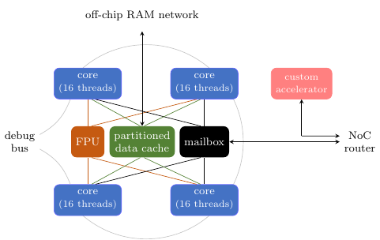

# Custom accelerators

Tinsel supports external custom accelerators written in Verilog or
SystemVerilog when the `UseCustomAccelerators` configuration option is
set.  With this option, each tile in the Tinsel overlay
now includes a custom accelerator.  The mailbox and the custom
accelerator share connections to the NoC router.



## Custom accelerator interface

The accelerator interface is currently quite simple:

```sv
module ExternalTinselAccelerator
  ( // Clock and reset
    // By default, BSV synchronises on negedge(clock) and uses negative reset
    input wire clk
  , input wire rst_n

    // Coordinates of this FPGA board in the board mesh
  , input wire [`TinselMeshXBits-1:0] board_x
  , input wire [`TinselMeshYBits-1:0] board_y

    // Stream of flits coming in
  , input wire [$bits(Flit)-1:0] in_data
  , input wire in_valid
  , output wire in_ready

    // Stream of flits going out
  , output wire [$bits(Flit)-1:0] out_data
  , output wire out_valid
  , input wire out_ready
  );

  // Compile-time NoC coordinates of this accelerator
  parameter TILE_X = 0;
  parameter TILE_Y = 0;

  // Module body here
  // ...
endmodule
```

Note the use of Verilog macros such as `TinselMeshXBits` and
`TinselMeshYBits`.  These can be generated automatically by running
[config.py](https://github.com/POETSII/tinsel/blob/master/config.py)
with the `vpp` option (which stands for Verilog pre-processor).

## Flit format

Here is the flit format, as a SystemVerilog structure:

```sv
typedef struct packed {
  // Destination address
  NetAddr dest;
  // Payload
  logic [`TinselBitsPerFlit-1:0] payload;
  // Is this the final flit in the message?
  logic notFinalFlit;
  // Is this a special packet for idle-detection?
  logic isIdleToken;
} Flit;
```

## Address format

Here is the address format for the `dest` field in a flit.  Note the
`acc` field, which determines whether a packet is destined for a
custom accelerator or a mailbox.

```sv
typedef struct packed {
  logic acc;
  logic host;
  logic hostDir;
  logic [`TinselMeshYBits-1:0] boardY;
  logic [`TinselMeshXBits-1:0] boardX;
  logic [`TinselMailboxMeshYBits-1:0] tileY;
  logic [`TinselMailboxMeshYBits-1:0] tileX;
  logic [`TinselLogCoresPerMailbox-1:0] coreId;
  logic [`TinselLogThreadsPerCore-1:0] threadId;
} NetAddr;
```

## Tinsel API extensions

The following Tinsel API function is provided for obtaining the
address of a specified custom accelerator from software land.

```c++
inline uint32_t tinselAccId(
         uint32_t boardX, uint32_t boardY,
           uint32_t tileX, uint32_t tileY);
```

## Full walkthrough

**Step 1**.  Modify `config.py` to your requirements.  For example,
if we want a 2x2 mesh of tiles, i.e. 4 Tinsel tiles and 4
accelerators, then we would choose the following parameters.

```py
# Number of bits in mailbox mesh X coord
p["MailboxMeshXBits"] = 1
 
# Number of bits in mailbox mesh Y coord
p["MailboxMeshYBits"] = 1

# Log of number of caches per DRAM port
p["LogDCachesPerDRAM"] = 1

# Enable custom accelerators (experimental feature)
p["UseCustomAccelerator"] = True
```

If your planning to run Tinsel on a single-board machine, such as
`zitura`, then make sure to specify this too:

```py
# Mesh X length within a box
p["MeshXLenWithinBox"] = 1
 
# Mesh Y length within a box
p["MeshYLenWithinBox"] = 1
```

**Step 2**. We've knocked up a sample accelerator for testing
purposes: [ExampleAccelerator.sv](ExampleAccelerator.sv).  This
accelerator receives any flit and sends it to the address specified in
the first word of the flit's payload.

**Step 3**. Update `de5/Golden_top.qsf` to specify location of the
custom accelerator.  For example, add the line

```
set_global_assignment -name SYSTEMVERILOG_FILE ../doc/custom/ExampleAccelerator.sv
```

to use the sample accelerator.

**Step 4**. Use the `config.py` script to generate Verilog macros
containing all the Tinsel parameters.  Make sure the generated file is
in the same directory as any file that includes it.

```
python config.py vpp > config.v
```

**Step 5**.  Build the Quartus project.  In the `de5` subdirectory,
simply type `make one` to do a single build, or `make` to do multiple
builds with different seeds (good if timing is tight).
